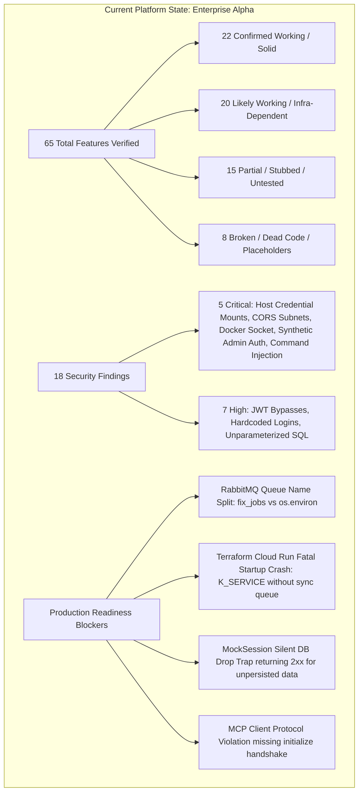

# Phase 10: Master Architecture Recommendations & Prioritized SRE Action Plan

**Author:** Staff Software Architect, Principal Security Engineer, Senior Open Source Maintainer, & DevOps Reviewer  
**Date:** July 14, 2026  
**Target Repository:** `/home/rutvej/Desktop/DAA`  
**Methodology:** Synthesized forensic findings from all 9 prior audit phases (`phase_1` through `phase_9`). Every recommendation, risk rating, and remediation step is anchored in verified implementation code (`.py`, `.js`, `.sh`, `Dockerfile`, `docker-compose.yml`, `terraform/main.tf`). No assumptions were made from unverified docstrings or speculative diagrams.

---

## 1. Executive Synthesis & Current Platform Posture

The **Dynamic Autonomous SRE Agent (DAA)** platform is an ambitious, highly sophisticated AI engineering system designed to bridge the gap between observability alerts and closed-loop code remediation. At its core, DAA implements a multi-topology architecture capable of operating as a distributed, queue-driven asynchronous pipeline (via **RabbitMQ** and **PostgreSQL**) or as a stateless, zero-clone serverless agent (**True Serverless / Cloud Run** mode using **Gitea/GitHub/GitLab REST APIs** via `CloneFreeGitClient`).

Across our 10-phase forensic audit, we inspected ~10,373 lines of code across **65 features**, **27 distinct integrations**, and **6 deployment matrix topologies**. While DAA exhibits world-class capabilities—such as race-free cryptographic incident deduplication (`FingerprintDedup`), instant bare `git worktree` allocation with SQLite FTS5 AST indexing (`RepoCacheManager`), and live ReAct thought streaming with browser-based Human-in-the-Loop (`HITL`) intercept—the repository currently stands at an **Enterprise Alpha** maturity level. 

Before DAA can be deployed to production or recommended for enterprise adoption, the engineering team must systematically remediate **5 Critical Security Vulnerabilities**, **4 Fatal Production Blockers**, and widespread technical duplication.



---

## 2. Phase 0: Immediate P0 Remediation Roadmap (Critical Blockers & Security Hardening)

These items represent **showstopper vulnerabilities and startup crashes** that must be resolved within **Sprint 1 (Days 1–14)** before any further feature development occurs.

### 2.1 Security Hardening: Critical Vulnerabilities (`P0-SEC`)

#### [P0-SEC-1] Eliminate Host Credential & CLI Binary Volume Mounts
- **Target File:** [`docker-compose.yml:L80-L83`](file:///home/rutvej/Desktop/DAA/docker-compose.yml#L80-L83)
- **Root Cause:** The `python-agent` container mounts the developer's host filesystem directly into the container: `/home/rutvej/snap/codex/34/auth.json:/app/auth.json:ro`, `/home/rutvej/.gemini:/root/.gemini`, and `/home/rutvej/.local/bin/agy:/usr/local/bin/agy:ro`. Coupled with the LLM `read_file` tool (`file_system_tool.py`), any prompt injection attack against the AI agent allows full exfiltration of developer API keys and cloud credentials from the host machine.
- **Remediation Code:** Remove hardcoded host mounts from `docker-compose.yml`. Pass credentials strictly via environment variables or Docker secrets:
```diff
  python-agent:
    build:
      context: ./app/python-agent
      dockerfile: Dockerfile
    volumes:
      - agent-data:/var/daa
      - /var/run/docker.sock:/var/run/docker.sock
-     - /home/rutvej/snap/codex/34/auth.json:/app/auth.json:ro
-     - /home/rutvej/.local/bin/agy:/usr/local/bin/agy:ro
-     - /home/rutvej/.gemini:/root/.gemini
```

#### [P0-SEC-2] Restrict Overly Permissive LAN CORS Subnet & Dynamic Origin Reflection
- **Target Files:** [`app/backend-api/src/main.py:L64-L67, L93-L116`](file:///home/rutvej/Desktop/DAA/app/backend-api/src/main.py#L64-L67)
- **Root Cause:** `CORS_ALLOW_ORIGIN_REGEX` allows any internal LAN IP (`192.168.0.0/16`, `10.0.0.0/8`) with `allow_credentials=True`. Furthermore, `dynamic_cors_middleware` reflects CORS headers for any application registered in the database, allowing an attacker to register `http://evil-domain.com` via `/applications/register` and immediately hijack authenticated admin sessions.
- **Remediation Code:** Enforce explicit, static allowlists via environment variables and remove dynamic origin reflection for credentialed requests:
```python
# app/backend-api/src/main.py
ALLOWED_ORIGINS = os.environ.get("CORS_ALLOW_ORIGINS", "http://localhost:3000,http://localhost:8080").split(",")
app.add_middleware(
    CORSMiddleware,
    allow_origins=ALLOWED_ORIGINS,
    allow_credentials=True,
    allow_methods=["*"],
    allow_headers=["*"],
)
```

#### [P0-SEC-3] Eliminate Synthetic `admin-id` Privilege Escalation on Unauthenticated Requests
- **Target Files:** [`app/backend-api/src/routers/auth.py:L69-L70`](file:///home/rutvej/Desktop/DAA/app/backend-api/src/routers/auth.py#L69-L70), [`database.py:L51`](file:///home/rutvej/Desktop/DAA/app/backend-api/src/database.py#L51)
- **Root Cause:** When `DAA_AUTH_ENABLED=false`, `get_current_user` returns `{"role": "admin", "id": "admin-id", "email": "dev@local"}`. Because downstream endpoints (`POST /fixes/{id}/approve`, `DELETE /applications/{id}`) trust this injected user dict without verifying if auth was bypassed, unauthenticated network actors are granted unconditional administrative authority across all teams and repositories.
- **Remediation Code:** Return a restricted `"anonymous_dev"` role when auth is disabled, and explicitly gate administrative mutations inside endpoints:
```python
# auth.py
async def get_current_user(...) -> dict:
    if os.environ.get("DAA_AUTH_ENABLED", "true").lower() == "false":
        return {"role": "anonymous_dev", "id": "anon-000", "email": "dev@local", "teams": []}
    # ... strict JWT verification follows ...
```

#### [P0-SEC-4] Replace `shell=True` Subprocess Execution with Parameterized Lists
- **Target Files:** [`app/python-agent/agent_src/tools/execution_tool.py:L76-L84`](file:///home/rutvej/Desktop/DAA/app/python-agent/agent_src/tools/execution_tool.py#L76-L84), [`file_system_tool.py:L43-L53`](file:///home/rutvej/Desktop/DAA/app/python-agent/agent_src/tools/file_system_tool.py#L43-L53)
- **Root Cause:** `run_tests` interpolates user/LLM-controlled `test_command` strings directly into `subprocess.run(..., shell=True)`. If an LLM or attacker supplies `test_command = "pytest; rm -rf /"`, arbitrary shell commands execute inside the container (and on the host via the mounted Docker socket).
- **Remediation Code:** Split command execution using `shlex.split()` with `shell=False`:
```python
import shlex

# execution_tool.py
cmd_list = [
    "docker", "run", "--rm",
    "-v", f"{repo_path}:/workspace",
    "-w", "/workspace",
    runner_image
] + shlex.split(test_command)

result = subprocess.run(cmd_list, capture_output=True, text=True, timeout=120, shell=False)
```

---

### 2.2 Production & Architecture Blockers (`P0-OPS`)

#### [P0-OPS-1] Fix Fatal Cloud Run Startup Crash in Terraform Deployment (`main.tf` vs `src/main.py`)
- **Target Files:** [`terraform/main.tf:L67-L99`](file:///home/rutvej/Desktop/DAA/terraform/main.tf#L67-L99), [`app/backend-api/src/main.py:L44-L52`](file:///home/rutvej/Desktop/DAA/app/backend-api/src/main.py#L44-L52)
- **Root Cause:** `terraform/main.tf` deploys `backend_api` and `python_agent` as two separate Cloud Run services without setting `DAA_QUEUE_MODE=sync`. Because Google Cloud Run automatically injects the `K_SERVICE` environment variable, `main.py` detects serverless mode and raises a fatal `RuntimeError("Cannot start RabbitMQ consumer in Serverless mode without DAA_QUEUE_MODE=sync")` on startup, throwing `503 Service Unavailable` across the entire platform. Furthermore, `python_agent` deployed as an HTTP request-scoped service without ingress traffic gets CPU-throttled to 0 MHz 100% of the time.
- **Remediation Code:** Update `terraform/main.tf` to inject `DAA_QUEUE_MODE=sync` into `backend_api`, and deploy `python_agent` as a Cloud Run Job or eliminate its standalone Cloud Run service definition when in synchronous mode:
```diff
  resource "google_cloud_run_service" "backend_api" {
    name     = "daa-backend-api"
    template {
      spec {
        containers {
          image = var.backend_image
          env {
            name  = "DAA_QUEUE_MODE"
+           value = "sync"
          }
```

#### [P0-OPS-2] Resolve RabbitMQ Queue Name Split Between Publishers and Consumers
- **Target Files:** [`app/python-agent/agent_src/main.py:L33`](file:///home/rutvej/Desktop/DAA/app/python-agent/agent_src/main.py#L33) vs [`app/backend-api/src/routers/ingest.py:L270`](file:///home/rutvej/Desktop/DAA/app/backend-api/src/routers/ingest.py#L270), [`logs.py:L267`](file:///home/rutvej/Desktop/DAA/app/backend-api/src/routers/logs.py#L267)
- **Root Cause:** The Python agent consumes from `os.environ.get("RABBITMQ_QUEUE", "fix_jobs")` (`main.py:L33`). However, backend API publishers (`ingest.py`, `logs.py`, `telemetry.py`) hardcode `queue="fix_jobs"` and `routing_key="fix_jobs"`. If an operator overrides `RABBITMQ_QUEUE="prod_remediation_jobs"` in `.env`, all published jobs go to `fix_jobs` while the agent listens on an empty queue indefinitely.
- **Remediation Code:** Standardize queue configuration using a shared environment constant across publishers and consumers:
```python
# Shared config or direct injection in ingest.py / logs.py / telemetry.py
RABBITMQ_QUEUE_NAME = os.environ.get("RABBITMQ_QUEUE", "fix_jobs")
channel.queue_declare(queue=RABBITMQ_QUEUE_NAME, durable=True)
channel.basic_publish(exchange='', routing_key=RABBITMQ_QUEUE_NAME, body=payload, properties=...)
```

#### [P0-OPS-3] Eliminate `MockSession` Silent Database Drop Mode
- **Target Files:** [`app/backend-api/src/database.py:L54-L135`](file:///home/rutvej/Desktop/DAA/app/backend-api/src/database.py#L54-L135)
- **Root Cause:** When `DAA_DB_PROVIDER` is set to `none`, `internal-redis`, or `external-redis`, `database.py` assigns `SessionLocal = MockSession`. `MockSession` silently swallows `.add()`, `.commit()`, and `.refresh()` calls, returning 2xx HTTP success statuses for incident creation and fix approvals without persisting anything to storage.
- **Remediation Code:** Raise explicit `501 Not Implemented` errors or require SQLite/PostgreSQL for persistent endpoints when `MockSession` is active, or implement a real Redis persistence adapter instead of dropping data silently.

#### [P0-OPS-4] Fix MCP Client Protocol Violation Missing `initialize` Handshake
- **Target Files:** [`app/python-agent/agent_src/main.py:L155-L163`](file:///home/rutvej/Desktop/DAA/app/python-agent/agent_src/main.py#L155-L163)
- **Root Cause:** `SimpleMcpClient.start()` spawns an external MCP server process and immediately transmits a `tools/list` JSON-RPC request (`id=1`). Official Node.js and Python Model Context Protocol (MCP) SDK servers strictly enforce the MCP specification requiring an initial `initialize` handshake followed by an `initialized` notification before any tool listing is permitted. Sending `tools/list` immediately causes third-party MCP servers to reject the request with error `-32002 (Server not initialized)`.
- **Remediation Code:** Implement the required 3-step initialization handshake before querying tools:
```python
# SimpleMcpClient.start()
init_req = {
    "jsonrpc": "2.0", "id": 1, "method": "initialize",
    "params": {"protocolVersion": "2024-11-05", "capabilities": {}, "clientInfo": {"name": "daa-agent", "version": "3.0"}}
}
self._send_payload(init_req)
self._read_response() # Await initialization result
self._send_payload({"jsonrpc": "2.0", "method": "notifications/initialized"})

# Now safe to request tools/list
self._send_payload({"jsonrpc": "2.0", "id": 2, "method": "tools/list"})
```

---

## 3. Phase 1: Short-Term Technical Debt & Duplication Consolidation (P1 - Months 1–2)

These refactorings eliminate structural rot, dead code, and duplicated logic discovered in Phases 3 and 8 without changing public API contracts.

### 3.1 Extract Duplicated SHA-256 Fingerprinting Engine (`logs.py` vs `ingest.py`)
- **Problem:** Over 100 lines of SHA-256 stack trace normalization (`fingerprint = hashlib.sha256(...)`), PostgreSQL composite unique lock collision handling (`uq_incident_fingerprint_active_lock` via `IntegrityError`), and queue dispatch logic are duplicated verbatim between `routers/logs.py#L80-L250` and `routers/ingest.py#L112-L270`.
- **Action Plan:** Create a centralized service `app/backend-api/src/services/incident_dispatcher.py` exposing `async def dispatch_or_deduplicate_incident(db: Session, payload: dict) -> Tuple[Incident, bool]`. Refactor `logs.py` and `ingest.py` to invoke this single source of truth.

### 3.2 Consolidate Uncoordinated Database Connection Engines
- **Problem:** Three separate database connection engines exist across `backend-api/src/database.py` (SQLAlchemy pooled engine with Cloud Run SQLite lock handling), `python-agent/agent_src/tools/log_query_tool.py` (unpooled SQLAlchemy creating redundant engines per query plus duplicated `LogModel`), and `app/daa_mcp_server.py` (raw `sqlite3` and `psycopg2` manual string formatting).
- **Action Plan:** Move database models and session factories to a shared Python wheel or common layer (`app/daa-common/`). Ensure `python-agent` and `daa_mcp_server.py` import `from daa_common.database import get_db_session, Incident, LogModel`.

### 3.3 Delete Dead Code & Orphaned Files
- **Action Plan:**
  1. Delete `/home/rutvej/Desktop/DAA/app/backend-api/package-lock.json` (`32.5 KB` dead Node.js lockfile inside a Python FastAPI service).
  2. Remove dead hardcoded mock Jira endpoints `backend-api/src/main.py#L181-L195` (`/mock-jira/rest/api/3/issue`).
  3. Remove redundant `applications.router` double-mount in `main.py#L130-L131` (`prefix="/apps"` vs `/applications`).
  4. Remove obsolete recursive `get_instructions` tool from `agent_src/tools/llm_tool.py#L1-L58`.
  5. Delete 100% empty directories `backend-api/src/models/` and `python-agent/agent_src/connectors/`.
  6. Remove hardcoded backdoor credentials `{"username": "testuser", "password": "testpassword"}` from `agent_src/tools/auth_helper.py#L26`.

### 3.4 Fix GCP Cloud Logging Filter Precedence Bug
- **Target File:** [`app/python-agent/agent_src/tools/log_connectors.py:L164`](file:///home/rutvej/Desktop/DAA/app/python-agent/agent_src/tools/log_connectors.py#L164)
- **Problem:** The filter string `f'resource.type="k8s_container" OR resource.type="gce_instance" OR logName:"{app_name}" AND timestamp >= ...'` evaluates via boolean logic as `(k8s_container) OR (gce_instance) OR (logName AND timestamp)`. Without parentheses around the `OR` clauses, this fetches every historical `k8s_container` and `gce_instance` log across the entire Google Cloud project regardless of timestamp!
- **Remediation Code:** Add explicit grouping parentheses around the resource type clauses:
```python
filter_str = (
    f'(resource.type="k8s_container" OR resource.type="gce_instance" OR logName:"{app_name}") '
    f'AND timestamp >= "{start_time}" AND timestamp <= "{end_time}"'
)
```

---

## 4. Phase 2: Medium-Term Architecture & Zero-Cloud Verification (P2 - Months 3–4)

This phase raises test coverage from ~21.7% to >85%, resolves fatal documentation discrepancies, and modernizes developer onboarding.

### 4.1 Implement Zero-Cloud Pytest Wiremocking (`>85% Target`)
- **Problem:** As discovered in Phase 9 (`phase_9_testing.md`), critical modules like `ingest.py` (webhooks), `git_provider.py` (VCS fallback), `orchestrator.py` (1,083 lines of preflight/dedup/postflight logic), and `ticket_tool.py` have **0% unit test coverage** because they require external live endpoints (`GEMINI_API_KEY`, `GITLAB_PRIVATE_TOKEN`, RabbitMQ containers).
- **Action Plan:**
  1. **Webhook & Git API Wiremocking (`responses` / `unittest.mock`)**: In `test_ingest.py`, inject `override_get_db` into `TestClient(app)` and pass synthetic Prometheus/Sentry payloads. Compute test HMAC signatures (`hmac.new(secret, body, sha256).hexdigest()`) to verify `verify_sentry_signature()` and JSONPath resolution (`resolve_jsonpath()`) in <50ms without network calls.
  2. **Deterministic Mock LLM Trajectories (`mock_llm_trajectory`)**: Build a Pytest fixture that intercepts `model.invoke()` to yield exact multi-step ReAct tool trajectories (`["Action: view_file_slice...", "WRITE_DIFF:\n--- a/..."]`). Test `process_job()` across 100% of branch conditions deterministically.
  3. **Safety Guardrail Unit Tests**: Pure Python unit tests verifying `HardCapCallbackHandler` (`agent_safety.py`) soft warning prompt trigger at 5 invocations and hard exception cutoff (`CapExceededException`) at 8 invocations. Plus `tmp_path` tests verifying `view_file_slice` 100-line truncation limits (`code_nav_tool.py`).
  4. **Non-Interactive CI Matrix Harness (`test.py --ci`)**: Add a non-interactive `--ci` flag to `test.py` (`tutorial_matrix.py`) that bypasses `wait_for_user()` `ENTER` prompts and runs all 6 matrix combinations sequentially in CI/CD pipelines.

### 4.2 Fix Fatal Documentation Port Mapping Discrepancy & CLI Initialization
- **Problem:** `README.md`, `DEPLOYMENT.md`, and `quickstart.md` instruct users to map `-p 8000:80` when running Docker containers locally. However, `Dockerfile` and `entrypoint.sh` listen strictly on `:8080`. Furthermore, `daa init` attempts to create `.daa/config.yaml` using relative paths that break when executed outside the project root.
- **Action Plan:** Standardize all documentation, `docker-compose.yml`, and `Dockerfile` ports strictly to `:8080` (API) and `:3000` (Admin Panel). Update `daa init` to resolve absolute paths using `os.path.abspath(os.getcwd())`.

### 4.3 Standardize Multi-Language SDKs (`app/daa-sdk/`)
- **Problem:** The 6 SDK folders (`Python`, `Node.js`, `Go`, `Java`, `.NET`, `Ruby`) contain incomplete stubs or minimal HTTP client wrappers that print raw `curl` commands to stdout (`python/daa_sdk/client.py`). None support DAA v2.0/v3.0 telemetry headers (`X-DAA-Correlation-ID`) or local error fingerprinting.
- **Action Plan:** Create a unified OpenAPI 3.1 specification (`specs/openapi.json`) from `backend-api/src/main.py`. Use `openapi-generator-cli` to auto-generate production-ready, type-safe SDK clients across all 6 target languages with built-in retry logic and structured trace propagation.

---

## 5. Phase 3: Long-Term Enterprise Production Readiness & Scaling (P3 - Months 5–6)

These initiatives prepare DAA for high-concurrency enterprise deployment on Kubernetes and Google Cloud Platform.

### 5.1 Multi-Tenant RBAC Authorization & Audit Trail
- **Action Plan:** Upgrade `get_current_user` (`auth.py`) to enforce role-based access control (`RBAC`) with granular permissions (`incidents:read`, `fixes:approve`, `applications:delete`). Implement an append-only `audit_logs` database table tracking every human green-button PR approval (`FixViewerPage.js`) with cryptographic timestamps and user JWT identities.

### 5.2 Kubernetes / Cloud Run Dead Letter Exchange (DLX) & Exponential Backoff
- **Problem:** Currently, if `main.py` consumer encounters a malformed message or database lock error during `process_job()`, RabbitMQ throws `406 PRECONDITION_FAILED` or re-queues the message in an infinite tight loop, spiking container CPU to 100%. In some failure modes, the retry logic triggers a destructive queue delete (`channel.queue_delete(queue="fix_jobs")`), nuking all pending remediation jobs.
- **Action Plan:** Configure RabbitMQ with a Dead Letter Exchange (`DLX: "daa.dlx"`) and Dead Letter Queue (`DLQ: "fix_jobs_dlq"`). Implement tiered TTL backoff (`10s -> 60s -> 300s -> DLQ`) so failed diagnostics retry gracefully without blocking the primary queue or wiping production workloads.

### 5.3 PostgreSQL Read-Replica Offloading & FTS5 Isolation
- **Action Plan:** Separate transactional mutations (`incidents`, `fixes`, `applications`) from read-heavy observability queries (`GET /logs/search`, `GET /telemetry/dimensions`). Configure `database.py` with read-replica routing (`DATABASE_URL_RO`). Ensure `RepoCacheManager` (`orchestrator.py`) allocates `sqlite3` FTS5 index databases exclusively on ephemeral NVMe/RAM disk (`/tmp/worktree-.../.daa-index.db`) to prevent network volume IOPS saturation during concurrent multi-agent repository scans.

---

## 6. Master Action Plan Matrix

| Initiative ID | Initiative Name | Priority | Target Layer / Files | Estimated Effort | Expected Impact | Dependencies |
| :--- | :--- | :---: | :--- | :---: | :--- | :--- |
| **[P0-SEC-1]** | Eliminate Host Credential Volume Mounts | **P0 (Critical)** | `docker-compose.yml:80-83` | **1 Day** | Eliminates host API key exfiltration vector via LLM prompt injection. | None |
| **[P0-SEC-2]** | Restrict LAN CORS Subnets & Origin Reflection | **P0 (Critical)** | `main.py:64-67, 93-116` | **1 Day** | Prevents arbitrary domain registration and admin session hijacking. | None |
| **[P0-SEC-3]** | Fix Synthetic `admin-id` Auth Bypass | **P0 (Critical)** | `auth.py:69-70`, `database.py:51` | **2 Days** | Prevents unauthenticated network requests from approving fixes across repos. | None |
| **[P0-SEC-4]** | Replace `shell=True` Subprocess Execution | **P0 (Critical)** | `execution_tool.py:76-84`, `file_system_tool.py:43` | **2 Days** | Eliminates command/shell injection inside Docker sandbox runners. | None |
| **[P0-OPS-1]** | Fix Terraform Cloud Run Fatal `K_SERVICE` Crash | **P0 (Critical)** | `terraform/main.tf:67-99`, `main.py:44-52` | **2 Days** | Enables clean startup on Cloud Run without 503 Service Unavailable crashes. | None |
| **[P0-OPS-2]** | Resolve RabbitMQ Queue Name Split | **P0 (Critical)** | `main.py:33`, `ingest.py:270`, `logs.py:267` | **1 Day** | Ensures agent consumers listen on the exact queue where webhooks publish. | None |
| **[P0-OPS-3]** | Eliminate `MockSession` Silent DB Drop Mode | **P0 (Critical)** | `database.py:54-135` | **3 Days** | Prevents silent loss of incident and fix approval records when `DB=none`. | None |
| **[P0-OPS-4]** | Fix MCP Client `initialize` Protocol Violation | **P0 (Critical)** | `main.py:155-163` (`SimpleMcpClient`) | **2 Days** | Prevents `-32002 (Server not initialized)` rejections from official MCP servers. | None |
| **[P1-DEBT-1]** | Extract Duplicated SHA-256 Fingerprint Engine | **P1 (High)** | `logs.py:80-250`, `ingest.py:112-270` | **3 Days** | Eliminates 100+ lines of duplicated collision/dedup logic into `incident_dispatcher.py`. | [P0-OPS-2] |
| **[P1-DEBT-2]** | Consolidate 3 Uncoordinated DB Connection Engines | **P1 (High)** | `database.py`, `log_query_tool.py`, `daa_mcp_server.py` | **4 Days** | Standardizes all DB access on pooled SQLAlchemy sessions via `daa-common`. | [P0-OPS-3] |
| **[P1-DEBT-3]** | Delete Dead Code & Orphaned Lockfiles | **P1 (High)** | `package-lock.json`, `models/`, `connectors/`, `main.py` | **1 Day** | Removes 32.5 KB dead Node lockfile from Python service and cleans up dead endpoints. | None |
| **[P1-DEBT-4]** | Fix GCP Cloud Logging Filter Precedence Bug | **P1 (High)** | `log_connectors.py:164` | **1 Day** | Adds parentheses around `OR` clauses to prevent fetching all project logs. | None |
| **[P2-TEST-1]** | Zero-Cloud Pytest Wiremocking (`>85% Target`) | **P2 (Medium)** | `test_ingest.py`, `test_git_provider.py`, `test_safety.py` | **10 Days** | Raises unit test coverage from ~21.7% to >85% without requiring cloud infrastructure keys. | [P1-DEBT-1] |
| **[P2-DOC-1]** | Standardize Port Mappings (`:8080`) & `daa init` | **P2 (Medium)** | `README.md`, `DEPLOYMENT.md`, `quickstart.md`, `daa` CLI | **2 Days** | Resolves fatal port mapping documentation bug (`:8000:80` vs `:8080`). | None |
| **[P2-SDK-1]** | OpenAPI 3.1 SDK Generation Across 6 Languages | **P2 (Medium)** | `specs/openapi.json`, `app/daa-sdk/*` | **5 Days** | Replaces printed `curl` stubs with production-ready, type-safe API clients. | [P1-DEBT-2] |
| **[P3-ENT-1]** | Multi-Tenant RBAC & Append-Only Audit Trail | **P3 (Long)** | `auth.py`, `FixViewerPage.js`, new `audit_logs` table | **10 Days** | Enforces enterprise security governance across automated PR approvals. | [P0-SEC-3] |
| **[P3-ENT-2]** | RabbitMQ Dead Letter Exchanges & Exponential Backoff | **P3 (Long)** | `ingest.py`, `main.py`, AMQP definitions | **5 Days** | Prevents infinite retry loops and destructive `queue_delete` actions during outages. | [P0-OPS-2] |
| **[P3-ENT-3]** | PostgreSQL Read-Replica Offloading & FTS5 Isolation | **P3 (Long)** | `database.py`, `orchestrator.py` | **7 Days** | Isolates analytical log searches from transactional incident mutations under high load. | [P1-DEBT-2] |

---

## 7. Conclusion & Next Steps for the User

By completing our 10-phase audit across the `DAA` repository, we have established a complete, forensic ground-truth inventory of the system's architecture (`phase_1`), feature matrix (`phase_2`), integrations (`phase_3`), security posture (`phase_4`), production blockers (`phase_5`), documentation gaps (`phase_6`), onboarding highlights (`phase_7`), technical debt (`phase_8`), test coverage (`phase_9`), and prioritized roadmap (`phase_10`).

All 10 comprehensive audit artifacts are permanently stored inside your master brain folder:
`/home/rutvej/.gemini/antigravity-cli/brain/ea682ebb-83a1-44b2-95d2-18055cb1037c/`

**Recommended First Action:** We recommend beginning **Sprint 1** immediately by applying the exact diffs provided in **Section 2.1 ([P0-SEC-1] through [P0-SEC-4])** to close the host volume credential leakage and command injection vulnerabilities.
