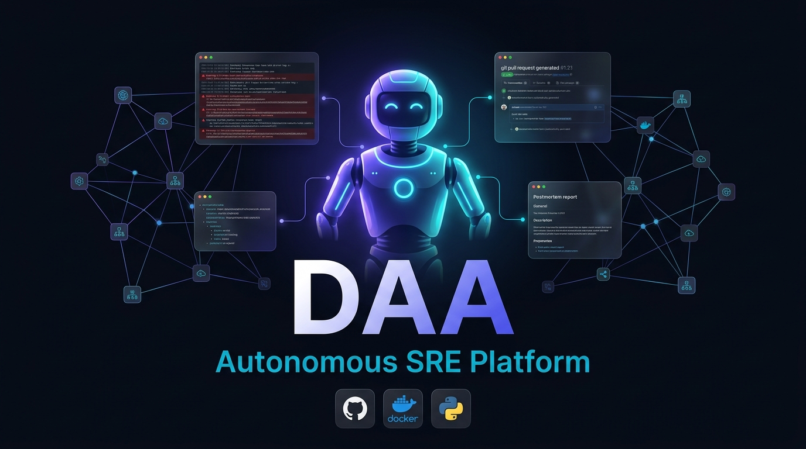

<div align="center">

# DAA — Debugging Autonomous Agent

**Your app breaks at 3am. DAA investigates the root cause and opens a pull request — while you sleep.**

[](https://www.python.org/)
[](./LICENSE)
[](https://fastapi.tiangolo.com/)
[](https://python.langchain.com/)
[](./Dockerfile)

</div>

<div align="center">
  
</div>

---

<div align="center">
  <video src="https://github.com/rutvej/DAA/raw/audit/comprehensive-10-phase-review/docs/assets/demo_video.mp4" controls="controls" muted="muted" style="max-height:640px;"></video>
</div>

---

## How it works

```
Error fires in your app at 3am
          ↓
DAA SDK catches it → sends to DAA (one line of code)
          ↓
SHA-256 deduplication — same error again? Suppressed silently.
New pattern? Agent wakes up.
          ↓
AI Agent investigates across 4 dimensions:
   • Git commits  →  what changed recently?
   • App logs     →  what's the stack trace?
   • Traces       →  which request triggered it?
   • Source code  →  AST navigation to the exact line
          ↓
Opens a Pull Request with:
   • A code fix
   • Root-cause explanation
   • Postmortem summary
          ↓
You wake up, review the PR, and merge.
```

<div align="center">
  
  <p><i>DAA investigating an error and proposing a fix via PR.</i></p>
</div>

---

## ⚡ Quickstart — Serverless Mode (1 Command)

The easiest way to run DAA is as a stateless webhook receiver via the standalone Docker image. No databases or queues required. 
It receives an alert, talks to the LLM, pushes a branch, and opens a PR.

**Requirements:** Docker, a free [Gemini API key](https://aistudio.google.com/app/apikey), and a GitHub Personal Access Token.

```bash
docker run -p 8000:8080 \
  -e LLM_PROVIDER=google \
  -e GEMINI_API_KEY="your_api_key_here" \
  -e DAA_DB_PROVIDER=none \
  -e DAA_GIT_TOKEN="github_pat_..." \
  -e GIT_HOST="https://github.com" \
  -e GIT_ORG="your-github-username" \
  rutvej1/daa-standalone:latest
```

Then trigger a test incident (simulating a webhook from Prometheus/Sentry):
```bash
curl -X POST http://localhost:8000/ingest/prometheus \
  -d '{"status": "firing", "alerts": [{"labels": {"alertname": "TestCrash"}}]}'
# → DAA immediately wakes up, clones the repo, queries the LLM, and opens a PR
```

*Want the full persistent stack (Postgres + RabbitMQ + UI)? See [DEPLOYMENT.md](./DEPLOYMENT.md).*

---

## 🔌 Two Ways to Integrate

DAA is flexible. You can plug it into your existing alerting stack, or instrument your code directly.

### 1. Existing Log Aggregators & Webhooks (Recommended for Serverless)
You do **not** need to use our SDK or change your app code. You can just point your existing alerting tools (Sentry, Datadog, Prometheus, CloudWatch) to DAA's webhook endpoints.
- **Auth:** Run DAA with `DAA_AUTH_ENABLED=false` and secure it behind your own API Gateway, AWS IAM, or Cloudflare Tunnel.
- **Dedup:** Rely on your existing aggregator to group the errors, and let DAA handle the autonomous fixing.

### 2. The DAA SDK (Recommended for Full-Stack)
If you don't have centralized logging, use the DAA SDK. 
- Requires deploying DAA with `DAA_AUTH_ENABLED=true` (usually via Docker Compose).
- You register your app, get a `DAA_TOKEN`, and the SDK securely pushes exceptions to DAA.

```python
# pip install daa-sdk
from daa_sdk import DAAClient

daa = DAAClient() # reads DAA_TOKEN from env
daa.report_exception(exception, app_name="my-service")
```

---

## What makes DAA different

| | Traditional alerting | DAA |
|--|--|--|
| **When it fires** | Every time the error happens | Once per unique error pattern |
| **What it tells you** | "Error occurred" | Root cause + code fix |
| **What you do** | Investigate manually | Review a PR |
| **3am pages** | Every time | Only for genuinely new problems |

---

## Features

| | |
|--|--|
| 🔁 **Zero alert fatigue** | SHA-256 fingerprint dedup + sliding-window cooldowns |
| 🧠 **4-dimension investigation** | Git history · Logs · Traces · AST code navigation |
| 🔒 **Agent safety** | Hard 8-tool-call budget cap — no runaway LLM costs |
| 🔀 **Any LLM** | Gemini · GPT-4o · Claude · Vertex · Ollama (air-gapped) |
| 👤 **Human-in-the-Loop** | Approve AI fixes before the PR lands |
| 🔧 **Any git forge** | GitHub · GitLab · Gitea · Bitbucket |
| 🌐 **MCP compatible** | Use DAA as a tool inside Claude Desktop or Cursor |

---

## Deployment

| Mode | Best for | How |
|------|----------|-----|
| **Single Docker container** | Try it out, small teams | `docker run -p 8000:8080 --env-file .env daa:latest` |
| **Docker Compose** | Self-hosted, persistent | `daa redeploy` |
| **Serverless** | Cloud Run / Fargate, zero-ops | `DAA_DB_PROVIDER=none DAA_GIT_MODE=api` |

Full guide: [DEPLOYMENT.md](./DEPLOYMENT.md)

---

## Architecture


```
DAA/
├── app/
│   ├── backend-api/    ← FastAPI: ingest, dedup, incident tracking
│   ├── python-agent/   ← LangChain ReAct SRE agent (the brain)
│   ├── admin-panel/    ← React dashboard
│   └── daa-sdk/        ← Python SDK (Node/Go/Java/Ruby/.NET community)
├── daa                 ← CLI tool (daa init / register / test / logs)
└── docs/               ← Documentation
```

---

## CLI

```bash
daa init              # Guided setup: LLM key, git token, deployment mode
daa register          # Register an app and get its DAA_TOKEN
daa policy            # Set escalation threshold (e.g. 3 errors in 60s)
daa test              # Fire a synthetic error and watch the pipeline
daa logs              # View recent incidents
daa status            # Health check all containers
daa redeploy          # Rebuild and restart everything
daa config set-model  # Switch LLM provider/model without restarting
```

---

## Security

Self-hosted and private by design. See [SECURITY.md](./SECURITY.md) for the full hardening guide.

- Credentials via environment variables only — never mounted as files into containers
- CORS restricted to an explicit allowlist (`CORS_ALLOW_ORIGINS`)  
- Webhook endpoints verify `DAA_API_KEY` + HMAC-SHA256 (Sentry)
- LLM agent tool-call budget is hard-capped (no unbounded loops)
- Report vulnerabilities: [GitHub Security Advisories](https://github.com/rutvej/DAA/security/advisories/new)

---

## Contributing

[CONTRIBUTING.md](./CONTRIBUTING.md) · [SECURITY.md](./SECURITY.md) · [LICENSE](./LICENSE)

PRs welcome. For large changes, open an issue first to align on the approach.

---

<div align="center">

**Built for engineers who are tired of being paged at 3am for the same error twice.**

⭐ Star this repo if it's useful · [Report a bug](https://github.com/rutvej/DAA/issues) · [Request a feature](https://github.com/rutvej/DAA/issues)

</div>
