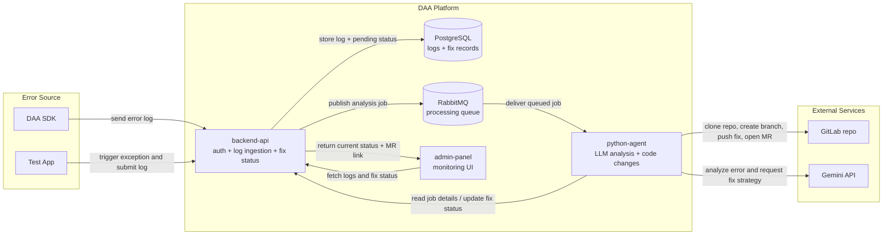

# DAA v2.0 — Autonomous SRE Incident Diagnosis Platform

[](https://deploy.cloud.run/?git_repo=https://github.com/rutvej/DAA.git)
[](https://railway.app/new/template?template=https://github.com/rutvej/DAA)
[](https://render.com/deploy?repo=https://github.com/rutvej/DAA)

DAA is an open-source, self-hosted **Autonomous SRE Incident Diagnosis Platform** that replaces the first 30–60 minutes of manual triage toil when production microservices break.

## 🚀 Why DAA v2.0?
- **No Alert Fatigue:** Built-in Redis sliding-window escalation thresholds and SHA256 error fingerprinting ensure zero duplicate PRs and zero alert spam.
- **4-Dimension Investigation:** Correlates OpenTelemetry trace IDs across 6 multi-language SDKs (Python, Go, Node.js, Java, Ruby, .NET), checks recent git commits/deployments, queries cloud alerts, and executes diagnostic tests before proposing a fix.
- **Surgical Code Navigation:** Uses AST repomaps and symbol searching so the LLM never reads entire repositories—saving 95% in token costs and eliminating hallucinated fixes.
- **Progressive Autonomy:** Operates in Advisor Mode (Jira/GitHub tickets + Postmortems), Draft PR Mode (human-in-the-loop), or Closed-Loop Auto-Remediation.
- **Local-First or Cloud LLMs:** Supports Google Gemini, OpenAI, Anthropic, or 100% air-gapped local models via Ollama / vLLM.

## Services
- `app/backend-api`: FastAPI service for auth, log ingestion, deduplication engine, escalation policies, and health.
- `app/python-agent`: ReAct SRE agent consumer that executes 4-dimension investigations and opens PRs or Jira tickets.
- `app/admin-panel`: React admin UI for viewing incident timelines, occurrence counters, and 1-click Postmortems.
- `app/daa-sdk`: Standardized SDKs for Python, Go, Node.js, Java, Ruby, and .NET.
- `app/test-app`: Sample microservice app that triggers errors for testing.
- Infrastructure: PostgreSQL, RabbitMQ, Redis, and GitLab (local) via Docker Compose or Terraform blueprints.

## Architecture
See `docs/PLATFORM_SPEC_V2.md` for the complete technical specification of the V2 Autonomous SRE Platform.

## Workflow Diagram
The diagram below shows the main end-to-end path from an application error to an auto-generated merge request:



Readable as 5 steps:
1. A client app sends an error log to `backend-api`.
2. `backend-api` stores the log in PostgreSQL and queues work in RabbitMQ.
3. `python-agent` consumes the job, asks Gemini for a fix strategy, and updates status.
4. `python-agent` pushes a fix branch to GitLab and opens a merge request.
5. `admin-panel` reads the latest log status and merge request link from `backend-api`.

## Quickstart
1. Copy environment template:
   ```bash
   cp .env.example .env
   ```
2. Fill in values in `.env` (see configuration section below).
3. Run the guided demo setup:
   ```bash
   python3 app/demo-setup/main.py
   ```
4. Open the admin panel at `http://localhost:5003`.
5. Register and log in using the Admin Panel UI.

For a manual bring-up flow, see `SETUP.md`. For detailed platform docs, see `docs/quickstart.md`.

## Demo Setup
The repo includes a guided demo CLI at `app/demo-setup/main.py` that automates the local end-to-end setup for:
- Docker services
- local GitLab project/token setup for `test-app`
- backend demo user creation and `DAA_TOKEN` generation
- restarting or recreating services when fresh env values are required
- interactive test-app error triggering and merge request monitoring

Run it with:
```bash
python3 app/demo-setup/main.py
```

Useful options:
```bash
python3 app/demo-setup/main.py --list-only
python3 app/demo-setup/main.py --start-step 5
```

The demo CLI uses `app/test-app` as the sample application and lets you trigger built-in scenarios such as `attribute-error`, `import-error`, `index-error`, `name-error`, `key-error`, `type-error`, `value-error`, and `new-error`.

Minimum `.env` values for the demo:
- `GEMINI_API_KEY`: required for the Python agent to analyze logs and generate fixes.
- `GITLAB_PRIVATE_TOKEN`: optional if omitted or invalid; the demo can create and refresh one automatically.
- `GITLAB_ROOT_PASSWORD`: used for local GitLab root login.
- `POSTGRES_PASSWORD`: password for the local Postgres container.
- `SECRET_KEY`: backend JWT signing key.

The demo script fills in safe local defaults for several other variables, including `REPO_NAME=test-app`, `RABBITMQ_HOST=rabbitmq`, and `GITLAB_HOST=gitlab`.

What to expect during the demo:
- `test-app` captures an exception and posts it to `backend-api`
- `backend-api` stores the log and publishes a job to RabbitMQ
- `python-agent` consumes the job, analyzes the code, pushes a branch to local GitLab, and opens a merge request
- the demo CLI watches for the new log and merge request URL

If you update tokens in `.env`, rerun the demo CLI so containers are recreated with the new values.

## Manual Quickstart
1. Copy environment template:
   ```bash
   cp .env.example .env
   ```
2. Fill in values in `.env` (see configuration section below).
3. Start services:
   ```bash
   docker-compose up -d
   ```
4. Open the admin panel at `http://localhost:5003`.
5. Register and log in using the Admin Panel UI.

For detailed steps (including GitLab setup), see `docs/quickstart.md` and `SETUP.md`.

## Configuration
Key variables required in `.env`:
- `SECRET_KEY`: JWT signing key for the backend API.
- `POSTGRES_PASSWORD`: Password for the Postgres service.
- `GITLAB_ROOT_PASSWORD`: Password used for local GitLab root.
- `GITLAB_PRIVATE_TOKEN`: GitLab access token used by the agent.
- `GEMINI_API_KEY`: API key for Google Gemini.
- `DAA_TOKEN`: Backend JWT token used by the SDK/test app.
- `REPO_NAME`: Repo name used by the SDK/test app (default `test-app`).

See `.env.example` for the full list.

## Tests
Backend API:
```bash
DATABASE_URL=sqlite:///./test.db RABBITMQ_HOST=localhost PYTHONPATH=app/backend-api/src pytest app/backend-api/tests/
```

Python agent:
```bash
python3 -m unittest discover app/python-agent/tests
```

Admin panel:
```bash
cd app/admin-panel
npm test -- --watchAll=false
```

## Known Gaps
These are documented areas that are incomplete or inconsistent today:
- Admin panel calls `/dashboard`, but backend has no `GET /dashboard` route.
- Log list endpoints are unauthenticated while log submission is authenticated.
- Python agent updates fix status but does not update the log status.
- Environment variable usage differs across services (see `docs/roadmap.md`).

## Documentation
- `docs/architecture.md`
- `docs/quickstart.md`
- `docs/roadmap.md`

## License
MIT. See `LICENSE`.
