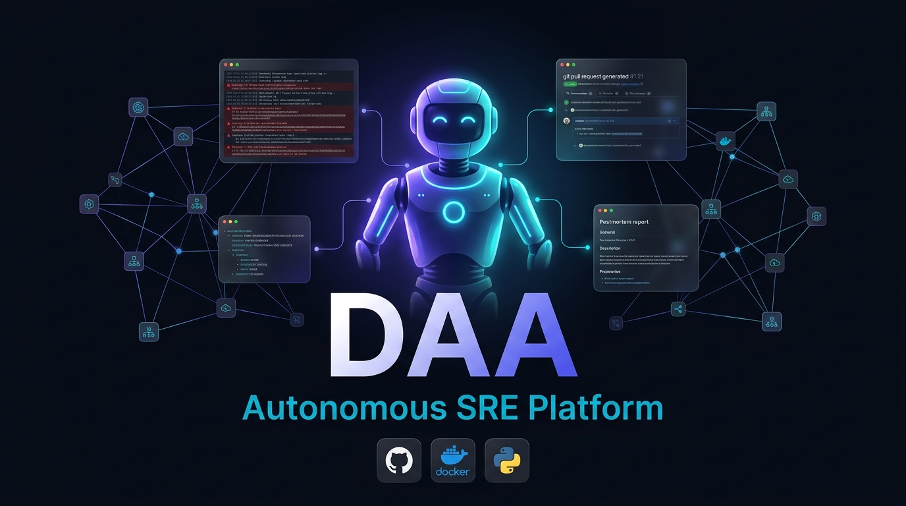

<div align="center">

# DAA — Debugging Autonomous Agent

**Your app breaks at 3am. DAA investigates the root cause and opens a pull request — while you sleep.**

[](https://www.python.org/)
[](./LICENSE)
[](https://fastapi.tiangolo.com/)
[](https://python.langchain.com/)
[](./Dockerfile)

</div>

<div align="center">
  
</div>
<p align="center">
  <video src="https://github.com/user-attachments/assets/38b77b21-f70a-4501-8308-bf88e03706fb" controls muted width="320" style="max-width: 100%;"></video>
</p>
---

## How it works

```
Error fires in your app at 3am
          ↓
DAA SDK catches it → sends to DAA (one line of code)
          ↓
SHA-256 deduplication — same error again? Suppressed silently.
New pattern? Agent wakes up.
          ↓
AI Agent investigates across 4 dimensions:
   • Git commits  →  what changed recently?
   • App logs     →  what's the stack trace?
   • Traces       →  which request triggered it?
   • Source code  →  AST navigation to the exact line
          ↓
Opens a Pull Request with:
   • A code fix
   • Root-cause explanation
   • Postmortem summary
          ↓
You wake up, review the PR, and merge.
```


---

## 🚀 Quickstart — GitHub Action (Easiest)

The fastest way to use DAA. No hosting, no PAT tokens, no Docker. Just add a workflow file and one secret.

**Requirements:** A free [Gemini API key](https://aistudio.google.com/app/apikey). That's it.

1. Add `GEMINI_API_KEY` to your repo secrets (Settings → Secrets → Actions)
2. Create `.github/workflows/daa.yml`:

```yaml
name: DAA - Auto Debug
on:
  issues:
    types: [opened, labeled]
  workflow_dispatch:
    inputs:
      error_description:
        description: 'Paste the error/stack trace'
        required: true

permissions:
  contents: write
  pull-requests: write
  issues: write

jobs:
  investigate:
    runs-on: ubuntu-latest
    steps:
      - uses: actions/checkout@v4
      - uses: rutvej/DAA/action@main
        with:
          llm_provider: google
          llm_api_key: ${{ secrets.GEMINI_API_KEY }}
```

Open an issue labeled `daa` with a bug description → DAA investigates and opens a fix PR.

*Full docs: [action/README.md](./action/README.md) · Supports issues, manual dispatch, external webhooks (Sentry/PagerDuty), and scheduled scans.*

---

## ⚡ Quickstart — Serverless Mode (Docker)

For production monitoring with real-time webhooks from Sentry/Prometheus/Datadog.

**Requirements:** Docker, a free [Gemini API key](https://aistudio.google.com/app/apikey), and a GitHub Personal Access Token.

```bash
docker run -p 8000:8080 \
  -e LLM_PROVIDER=google \
  -e GEMINI_API_KEY="your_api_key_here" \
  -e LLM_MODEL="gemini-2.5-flash" \
  -e DAA_DB_PROVIDER=none \
  -e DAA_GIT_TOKEN="github_pat_..." \
  -e GIT_HOST="https://github.com" \
  -e GIT_ORG="your-github-username" \
  rutvej1/daa-standalone:latest
```

Then trigger a test incident (simulating a webhook from Prometheus/Sentry):
```bash
curl -X POST http://localhost:8000/ingest/prometheus \
  -d '{"status": "firing", "alerts": [{"labels": {"alertname": "TestCrash"}}]}'
# → DAA immediately wakes up, clones the repo, queries the LLM, and opens a PR
```

*Want the full persistent stack (Postgres + RabbitMQ + UI)? See [DEPLOYMENT.md](./DEPLOYMENT.md).*

---

## 🔌 Three Ways to Integrate

DAA is flexible. Pick the integration that matches your needs.

### 1. GitHub Action (Recommended to Start)
Zero infrastructure. Add a workflow file and one secret to your repo. DAA runs on GitHub's free runners and opens PRs using the auto-injected `GITHUB_TOKEN`.
- **No PAT tokens, no hosting, no Docker.**
- Triggers: bug issues, manual dispatch, external webhooks, scheduled scans.
- **[→ GitHub Action Quick Start](./action/README.md)**

### 2. Existing Log Aggregators & Webhooks (Recommended for Production)
You do **not** need to use our SDK or change your app code. You can just point your existing alerting tools (Sentry, Datadog, Prometheus, CloudWatch) to DAA's webhook endpoints.
- **Auth:** Run DAA with `DAA_AUTH_ENABLED=false` and secure it behind your own API Gateway, AWS IAM, or Cloudflare Tunnel.
- **Dedup:** Rely on your existing aggregator to group the errors, and let DAA handle the autonomous fixing.

### 3. The DAA SDK (Recommended for Full-Stack)
If you don't have centralized logging, use the DAA SDK. 
- Requires deploying DAA with `DAA_AUTH_ENABLED=true` (usually via Docker Compose).
- You register your app, get a `DAA_TOKEN`, and the SDK securely pushes exceptions to DAA.

```python
# pip install daa-sdk
from daa_sdk import DAAClient

daa = DAAClient()  # reads DAA_TOKEN from env
daa.report_exception(exception, app_name="my-service")
```

---

## What makes DAA different

| | Traditional alerting | DAA |
|--|--|--|
| **When it fires** | Every time the error happens | Once per unique error pattern |
| **What it tells you** | "Error occurred" | Root cause + code fix |
| **What you do** | Investigate manually | Review a PR |
| **3am pages** | Every time | Only for genuinely new problems |

---

## Features

| | |
|--|--|
| 🔁 **Zero alert fatigue** | SHA-256 fingerprint dedup + sliding-window cooldowns |
| 🧠 **4-dimension investigation** | Git history · Logs · Traces · AST code navigation |
| 🔒 **Agent safety** | Hard 8-tool-call budget cap — no runaway LLM costs |
| 🔀 **Any LLM** | Gemini · GPT-4o · Claude · Vertex · Ollama (air-gapped) |
| 👤 **Human-in-the-Loop** | Approve AI fixes before the PR lands |
| 🔧 **Any git forge** | GitHub · GitLab · Gitea · Bitbucket |
| 🌐 **MCP compatible** | Use DAA as a tool inside Claude Desktop or Cursor |

---

## Deployment

| Mode | Best for | How |
|------|----------|-----|
| **GitHub Action** | Zero-friction, open source | [Add workflow file](./action/README.md) |
| **Single Docker container** | Try it out, small teams | `docker run -p 8000:8080 --env-file .env daa:latest` |
| **Docker Compose** | Self-hosted, persistent | `daa redeploy` |
| **Serverless** | Cloud Run / Fargate, zero-ops | `DAA_DB_PROVIDER=none DAA_GIT_MODE=api` |

Full guide: [DEPLOYMENT.md](./DEPLOYMENT.md)

---

## Architecture


```
DAA/
├── app/
│   ├── backend-api/    ← FastAPI: ingest, dedup, incident tracking
│   ├── python-agent/   ← LangChain ReAct SRE agent (the brain)
│   ├── admin-panel/    ← React dashboard
│   └── daa-sdk/        ← Python SDK (Node/Go/Java/Ruby/.NET community)
├── action/             ← GitHub Action vertical (zero-infra deployment)
├── daa                 ← CLI tool (daa init / register / test / logs)
└── docs/               ← Documentation
```

---

## CLI

```bash
daa init              # Guided setup: LLM key, git token, deployment mode
daa register          # Register an app and get its DAA_TOKEN
daa policy            # Set escalation threshold (e.g. 3 errors in 60s)
daa test              # Fire a synthetic error and watch the pipeline
daa logs              # View recent incidents
daa status            # Health check all containers
daa redeploy          # Rebuild and restart everything
daa config set-model  # Switch LLM provider/model without restarting
```

---

## Security

Self-hosted and private by design. See [SECURITY.md](./SECURITY.md) for the full hardening guide.

- Credentials via environment variables only — never mounted as files into containers
- CORS restricted to an explicit allowlist (`CORS_ALLOW_ORIGINS`)  
- Webhook endpoints verify `DAA_API_KEY` + HMAC-SHA256 (Sentry)
- LLM agent tool-call budget is hard-capped (no unbounded loops)
- Report vulnerabilities: [GitHub Security Advisories](https://github.com/rutvej/DAA/security/advisories/new)

---

## FAQ

**Q: Is DAA safe to use?**
A: Yes, DAA is self-hosted and private by design. It runs in your own environment (e.g., via Docker) and uses the API keys you provide.

**Q: Is my code safe?**
A: Absolutely. DAA only analyzes the specific context around a triggered error (such as the stack trace, related Git commits, and the specific lines of code in the AST). It does not scan or upload your entire codebase.

**Q: Is my code disclosed to the creators of DAA?**
A: No. DAA has no central server that receives your code or data. Any code context is sent directly from your self-hosted DAA instance to the LLM provider you configure (like Google Gemini, OpenAI, or a local Ollama instance).

**Q: Can it run entirely offline/air-gapped?**
A: Yes, you can configure DAA to use local LLMs (like Ollama) so no data ever leaves your network.

---

## Contributing

[CONTRIBUTING.md](./CONTRIBUTING.md) · [SECURITY.md](./SECURITY.md) · [LICENSE](./LICENSE)

PRs welcome. For large changes, open an issue first to align on the approach.

---

<div align="center">

**Built for engineers who are tired of being paged at 3am for the same error twice.**

⭐ Star this repo if it's useful · [Report a bug](https://github.com/rutvej/DAA/issues) · [Request a feature](https://github.com/rutvej/DAA/issues)

</div>
