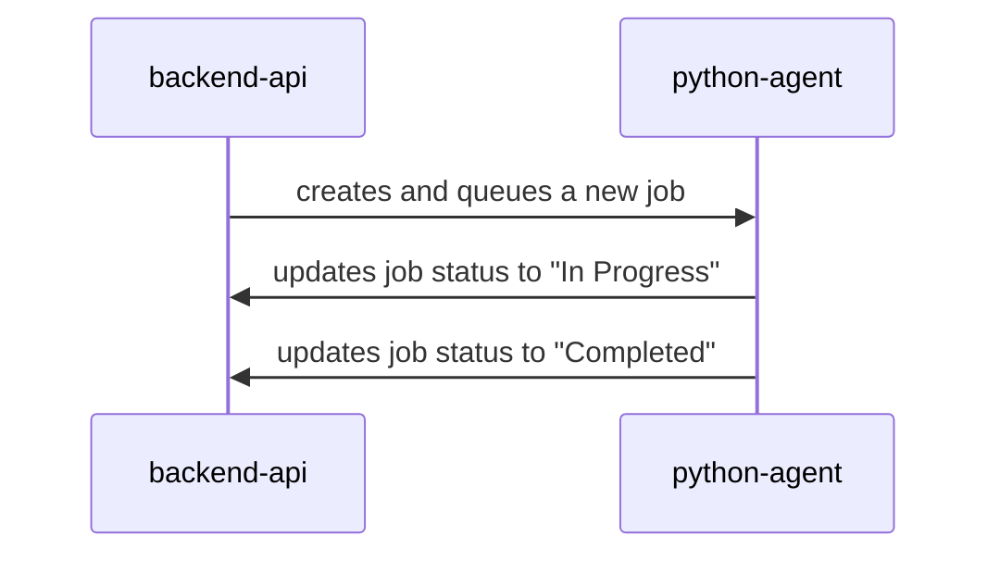

# Business Logic

This document outlines the business logic of the application, detailing the flow of events from the moment an error log is received to the creation of a merge request with a fix.

## Error Log Ingestion

1.  **Error Log Submission:** A client application submits an error log to the **Backend API**. This can be done either through a direct API call or by pasting the log into the **Admin Panel** UI.
2.  **Job Creation:** The **Backend API** receives the error log and creates a new job.
3.  **Job Queuing:** The job is then sent to the **Message Broker** to be processed asynchronously by the **Python Agent**.
4.  **Initial Status Update:** The **Backend API** creates an initial entry in the **Database** with a "Pending" status for the submitted log.

## Error Log Processing

1.  **Job Consumption:** The **Python Agent** picks up the job from the **Message Broker**.
2.  **Database Update:** The **Python Agent** updates the job status in the **Database** to "In Progress".
3.  **Code Retrieval:** The **Python Agent** identifies and retrieves the relevant code from the client's **Git Repository** based on the information in the error log.
4.  **LLM Interaction:** The **Python Agent** sends the error log and the relevant code to the **LLM** to generate a fix.

## Fix Generation and Merge Request

1.  **Fix Reception:** The **Python Agent** receives the generated fix from the **LLM**.
2.  **Merge Request Creation:** The **Python Agent** creates a new branch in the **Git Repository** and applies the fix. It then creates a merge request with the changes.
3.  **Database Update:** The **Python Agent** updates the job status in the **Database** to "Completed" and stores a link to the merge request.

## Status Tracking

1.  **Status Polling:** The **Admin Panel** periodically polls the **Backend API** to get the status of the submitted error log.
2.  **Status Retrieval:** The **Backend API** retrieves the latest status from the **Database** and sends it back to the **Admin Panel**.
3.  **UI Update:** The **Admin Panel** updates the UI to display the current status of the fix, including a link to the merge request when it's available.
