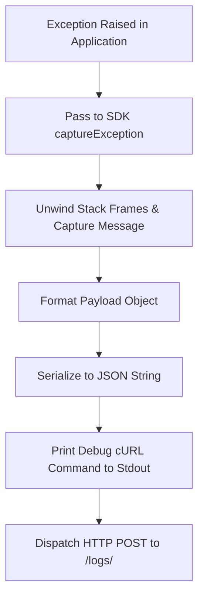

# DAA SDK Business Logic Specification

This document details the telemetry processing workflows, stack trace extraction steps, and error resilience policies within the DAA SDK.

## 1. Exception Capture Workflow

The following flowchart describes the operations executed when an application captures an error:

### Stack Frame Extraction details
- **Python**: Leverages the `traceback` standard library. `traceback.format_exc()` retrieves the complete call stack string.
- **NodeJS**: Inspects the `error.stack` property. It contains lines detailing filenames, function names, and line/column offsets.
- **Go**: Uses `runtime/debug.Stack()`. It unwinds Go runtime goroutines to dump active execution threads.

---

## 2. Ingestion Routing Dispatch

- **Destination**: Submits to `{DAA_BACKEND_API_URL}/logs/`.
- **Credential Header**: Attaches `Authorization: Bearer <DAA_TOKEN>` payload header.
- **Microservice context**: Attaches `REPO_NAME` (stored in the payload as `app_name`) to specify which project is affected.

---

## 3. Resilience and Error Swallowing Policies

Because SRE monitoring platforms are secondary services, they must never degrade primary business features:

- **Safety Wrapper**: The HTTP client POST dispatch is executed inside a `try/catch` or `defer` execution context:
  - If the Backend API is down, returns an HTTP 504 gateway error, or if network connectivity times out, the SDK catches the exception.
  - The error is written to the developer console log (as standard error outputs), but is prevented from propagating back to the runtime framework.
  - The host application continues processing requests without interruption.
