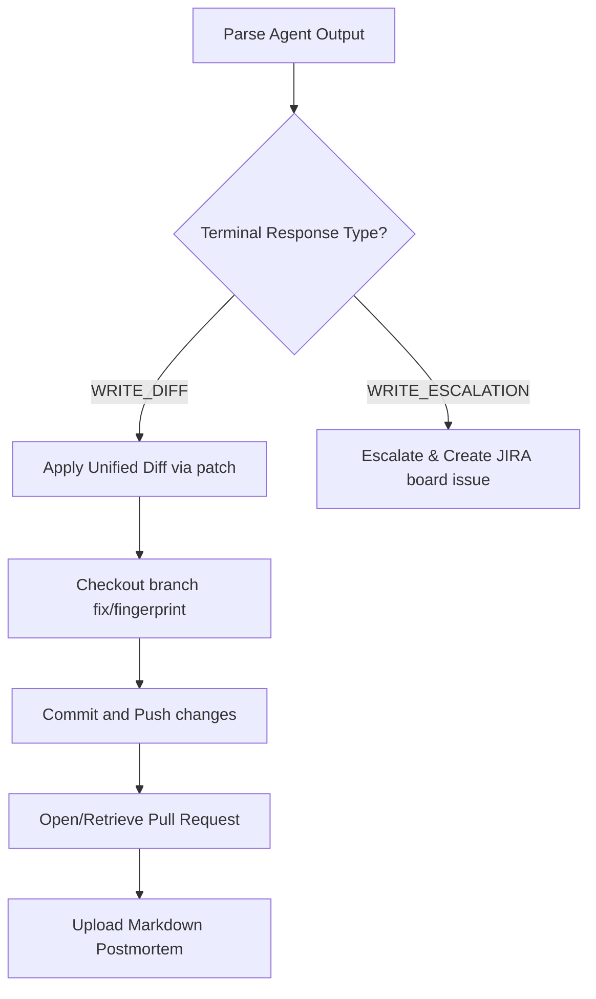

# Python Agent Business Logic Specification

This document details the LLM integrations, output sanitization filters, planning validators, and post-flight remediation routines in the Python Agent.

## 1. LLM Models & Custom Chat wrappers

The agent initializes chat models via `get_llm()` in [llm_config.py](file:///home/rutvej/Desktop/DAA/app/python-agent/src/llm_config.py#L283-L336):

### A. Codex Chat Model (`CodexChatModel`)
A custom chat model that routes queries to internal ChatGPT APIs. It contains extensive regex post-processors to force raw outputs into correct ReAct formats:
1. **Regex Normalization**:
   - Normalizes `"Input:"` prefixes: `re.sub(r'\bInput:\s*(?=\s*\{)', 'Action Input: ', output)`
   - Normalizes double-action statements: `re.sub(r'\bAction\s+Action\s+Input:', 'Action Input:', output)`
   - Appends missing Action Inputs: Inserts `Action Input:` before JSON blocks appended directly to `Action:`.
2. **Hardcoded Fallback Hack**: If the LLM generates a tool name but fails to emit any tool arguments (`Action Input`), the model uses a hardcoded fallback block to inject arguments. These fallbacks are specific to a single repository `checkout-service` and a typo bug `RedisCache.connec`:
   - Tool `clone_repo` -> `"checkout-service"`
   - Tool `read_repomap` -> `'{"repo_path": "/tmp/checkout-service"}'`
   - Tool `grep_search` -> `'{"query": "connec", "search_path": "/tmp/checkout-service"}'`
   - Tool `run_tests` -> `'{"repo_path": "/tmp/checkout-service", "test_command": "pytest"}'`
   - Tool `commit` -> `"/tmp/checkout-service, fix RedisCache.connec typo"`
3. **Truncation Filter**: Discards everything after the first `Action Input:` to prevent the model from hallucinations and executing multiple tools per turn.
4. **Final Answer Correction**: Injects `Final Answer:` prefix if the model writes postmortem details but forgets the prefix.

### B. Agy Chat Model (`AgyChatModel`)
Invokes the local command `agy --dangerously-skip-permissions --model <model> --print <prompt>`.
- **Fast Mode Cache**: If `DAA_AGENT_MODE=fast`, prompt inputs are hashed (SHA-256) and saved to `/tmp/daa_agy_cache/{hash}.txt`. Subsequent queries load this file to bypass CLI executions.

---

## 2. Safety Layers (`agent_safety.py`)

### Layer 1: Planning Step (`PlanningValidator`)
Pre-flight prepends structural requirements to the system prompt.
- **Enforcement**: The agent's very first response must contain a valid JSON block enclosing three keys: `"hypothesis"`, `"evidence_needed"`, and `"will_not_check"`.
- **Validation**: If the block is absent or keys are missing, the agent is blocked from calling any tools.

### Layer 2: Tool Ceilings (`HardCapCallbackHandler`)
Extends LangChain's `BaseCallbackHandler` to count tool runs:
- **Warning Threshold** (default: 5 calls): Sets a warning flag. The agent executor injects the string `[DAA BUDGET WARNING]` into the next model step to warn the LLM.
- **Budget Cap** (default: 8 calls): Immediately throws a `CapExceededException`. The `AgentSafetyWrapper` catches this and returns a fallback escalation result.

---

## 3. Post-Flight Patch & PR Pipeline

Managed by the `PostflightOrchestrator` after the agent generates its final response:

### Git Actions
- **Local Git Mode**: Uses subprocess calls (`git checkout`, `git add`, `git commit`, `git push`) inside the `/tmp/daa/<incident_id>` worktree.
- **API Git Mode** (for stateless containers): Uses the `CloneFreeGitClient`. Files parsed from the diff are retrieved via GitLab API, patched in the virtual container worktree, pushed to a new branch, and committed via GitLab commits REST API.
- **Idempotency**: Before creating a Pull Request, the orchestrator queries the repository's open pulls list matching the head branch. If a PR exists, it retrieves the URL instead of opening a duplicate.

---

## 4. Secure Multi-Repository Context Access

To allow the SRE Agent to triage bugs that stem from shared libraries, dependencies, or upstream microservices:

1. **Authorization via Registration**: The SRE Agent is strictly prohibited from pulling code from arbitrary URLs injected dynamically in incoming error logs (guarding against Server-Side Request Forgery - SSRF). It can only fetch data from secondary repositories that are explicitly pre-registered in the DAA database.
2. **Work isolation (Primary Target)**: For any given incident log, the SRE Agent will only clone/worktree and execute code modifications on the target application's repository. Only this primary repository gets written to and verified via test execution on-disk.
3. **Read-Only Hybrid Access**: Any auxiliary repositories registered as dependencies are accessed in a read-only manner. Instead of being cloned to the SRE worker disk, their files are queried dynamically via Git REST APIs (GitHub/GitLab/Gitea) using `CloneFreeGitClient`, keeping the SRE worker workspace isolated and lightweight.
