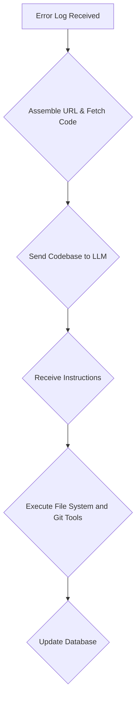

# Python Agent Business Logic

## 1. Agent Process

The following diagram illustrates the process that the agent follows to analyze an error and generate a fix:

## 2. Tools

The Python Agent has access to a set of tools that it can use to perform specific tasks. The agent uses the Langchain library to orchestrate the execution of these tools.

### 2.1. Git Tool

The Git Tool is responsible for interacting with the git repository of the application. It has the following functions:

-   **clone_repo**: Clones the repository to a temporary directory. The git URL will be assembled from the app name. The branch will always be `main`.
-   **create_branch**: Creates a new branch.
-   **commit**: Commits the changes to the current branch. The git user will be hardcoded in the Docker container.
-   **push**: Pushes the changes to the remote repository.
-   **create_pull_request**: Creates a pull request with a description generated by the LLM.

### 2.2. File System Tool

The File System Tool is responsible for interacting with the file system. It has the following functions:

-   **read_file**: Reads the content of a file.
-   **write_file**: Writes content to a file.
-   **list_files**: Lists all files in the repository.

### 2.3. LLM Tool

The LLM Tool is responsible for interacting with the large language model (LLM). It has the following functions:

-   **get_instructions**: Sends the error log and the entire codebase to the LLM. The LLM will return a set of instructions for the agent to follow, which may include using the File System Tool to modify files and the Git Tool to create a pull request.
-   **Note**: The agent will use the Gemini API as its LLM.

### 2.4. Database Tool

The Database Tool is responsible for interacting with the database. It has the following functions:

-   **update_status**: Updates the status of the analysis in the database.
-   **update_pull_request**: Updates the database with the URL of the pull request.
