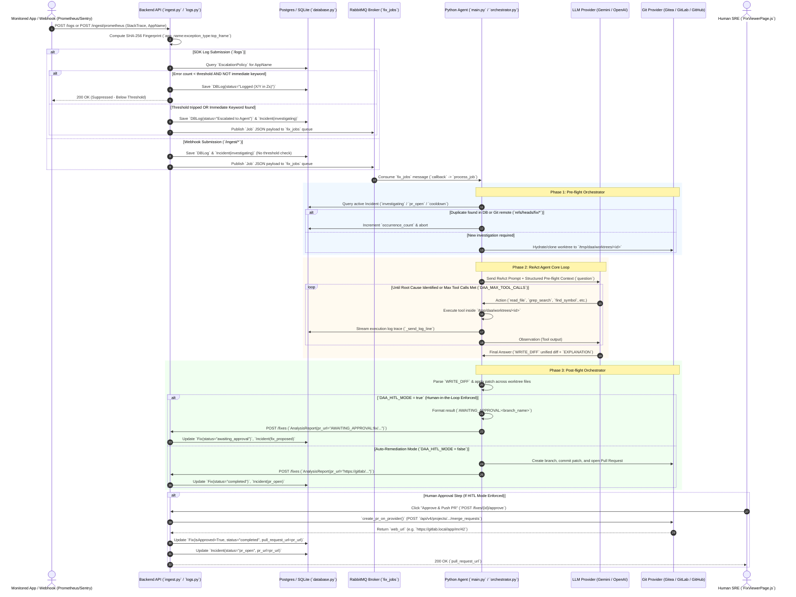

# DAA v3.0 Repository Architecture & Execution Flow Report
**Phase 1 Audit Report**
*Author: Architecture Specialist Subagent*  
*Date: 2026-07-14*  
*Repository Root:* `/home/rutvej/Desktop/DAA`  

---

## 1. Executive Architecture Overview

The **DAA (Dynamic Autonomous SRE Platform) v3.0** repository (`/home/rutvej/Desktop/DAA`) is a full-stack, AI-powered Site Reliability Engineering and incident remediation platform. Unlike conventional monitoring tools that stop at alert notification, DAA operates autonomously across the full incident lifecycle: ingesting production errors and webhooks, evaluating sliding-window escalation policies, checking git/database deduplication states, spawning autonomous LLM investigation agents to locate the root cause in application source code, and synthesizing unified diff patches to open verified Pull Requests/Merge Requests or await human-in-the-loop (HITL) approval.

### 1.1 Core Architectural Principles
1. **Pluggable & Dual-Mode Deployment Topology (`Staging Matrix`)**:
   - **Standalone Single-Image Mode (`Image`)**: Built via `/home/rutvej/Desktop/DAA/Dockerfile` and managed by `/home/rutvej/Desktop/DAA/entrypoint.sh`. A single Alpine container hosts internal SQLite/Postgres/Redis instances, runs the FastAPI backend on port `8080`, optionally spawns the Python SRE agent as a background process, and bakes in a minimal HTML/JS admin console (`/admin`).
   - **Distributed Microservices Mode (`Compose`)**: Orchestrated by `docker-compose.yml`. Splits separation of concerns across dedicated containers: `postgres` (database), `rabbitmq` (AMQP broker), `backend-api` (FastAPI server on `:8000`), `python-agent` (asynchronous queue worker), `admin-panel` (React 18 SPA served via Nginx on `:5003`), and `mcp-server` (Model Context Protocol stdio adapter).
2. **Pluggable Persistence (`DAA_DB_PROVIDER`)**:
   - Evaluated dynamically in `app/backend-api/src/database.py`. Supports full relational persistence (`sqlite`, `postgres`, `internal-postgres`, `external-postgres`) via SQLAlchemy, as well as a completely stateless **`MockSession` (`none`) mode** where all state is held in-memory and deduplication relies directly on querying remote Git branches (`refs/heads/fix/*`).
3. **Three-Phase Agent Pipeline (DAA 3.0)**:
   - **Phase 1 (Pre-flight Orchestrator)**: Fingerprint deduplication, repository workspace hydration/cloning (`RepoCacheManager`), and context packaging.
   - **Phase 2 (Agent Core)**: ReAct investigation loop powered by LangChain (`ChatGoogleGenerativeAI`, `ChatOpenAI`, etc.), equipped with read-only repository navigation tools (`read_file`, `grep_search`, `find_symbol`, `view_file_slice`, `read_repomap`) and hard-cap loop protection (`AgentSafetyWrapper`).
   - **Phase 3 (Post-flight Orchestrator)**: Decodes structured terminal answers (`WRITE_DIFF` / `WRITE_ESCALATION`), applies patches across multi-file boundaries, and idempotently pushes commits or returns `AWAITING_APPROVAL:<branch>` to trigger HITL gating.

---

## 2. Complete Entry Point Inventory

All line counts and file paths below were verified directly against implementation source files (`.py`, `.js`, `.yml`, `Dockerfile`, `.sh`).

| Component / Category | Exact File Path (`/home/rutvej/Desktop/DAA/...`) | Line Count | Primary Role & Description |
| :--- | :--- | :---: | :--- |
| **CLI & Tools** | `daa` | 998 | Main CLI tool for guided init (`daa init`), app registration (`daa register`), policy setup, MCP management, and triggering test errors. |
| **Test Matrix** | `test.py` | 1,082 | Tutorial and automated matrix runner testing all combinations of `staging`, `db`, `queue`, `git`, `auth`, and `policy`. |
| **Test Matrix** | `generate_matrix.py` | 59 | Helper script generating the combinatorial matrix markdown (`matrix.md`). |
| **Docker Composition** | `docker-compose.yml` | 122 | Distributed 6-service orchestration (`postgres`, `rabbitmq`, `backend-api`, `python-agent`, `admin-panel`, `mcp-server`). |
| **Root Supervisor** | `Dockerfile` | 39 | Builds single-image supervisor (`python:3.11-alpine`) with embedded backend-api, python-agent, and database. |
| **Root Supervisor** | `entrypoint.sh` | 57 | Startup script for single-image mode (`DAA_DB_PROVIDER=internal-postgres`, `sync` worker vs background thread). |
| **Backend API Entry** | `app/backend-api/src/main.py` | 195 | FastAPI initialization, database migration checks, dynamic CORS registration, `CORS_ALLOW_ORIGINS`, and router mounting. |
| **Backend DB / Models** | `app/backend-api/src/database.py` | 387 | `DAA_DB_PROVIDER` resolution, `MockSession` definition, and ORM schema (`User`, `Log`, `Fix`, `Incident`, `Application`, `EscalationPolicy`, `Alert`). |
| **Backend Routers** | `app/backend-api/src/routers/ingest.py` | 414 | Webhook ingestion endpoints (`/ingest/prometheus`, `/ingest/sentry`, `/ingest/custom`) and `dispatch_investigation` job creator. |
| **Backend Routers** | `app/backend-api/src/routers/logs.py` | 353 | Standard `/logs` and `/logs/batch` ingestion endpoints enforcing `EscalationPolicy` sliding-window thresholds (`submit_log`). |
| **Backend Routers** | `app/backend-api/src/routers/fixes.py` | 409 | Receives `AnalysisReport` (`/fixes`), handles `AWAITING_APPROVAL` states, and executes HITL approval (`/fixes/{id}/approve`). |
| **Backend Routers** | `app/backend-api/src/routers/git_provider.py` | 472 | Abstraction layer for creating branches, commits, and Pull Requests against Gitea, GitLab, and GitHub. |
| **Backend Routers** | `app/backend-api/src/routers/applications.py` | 254 | CRUD endpoints for application registry and API token generation. |
| **Backend Routers** | `app/backend-api/src/routers/incidents.py` | 204 | Active incident list/detail queries and manual status transitions. |
| **Backend Routers** | `app/backend-api/src/routers/auth.py` | 128 | JWT bearer token login (`/auth/login`) and synthetic admin handling when `DAA_AUTH_ENABLED=false`. |
| **Backend Routers** | `app/backend-api/src/routers/alerts.py` | 120 | System health alerting records and webhook receiver checks. |
| **Backend Routers** | `app/backend-api/src/routers/dashboard.py` | 105 | Aggregated metrics endpoint for the React admin console dashboard view. |
| **Backend Routers** | `app/backend-api/src/routers/projects.py` | 108 | Connection credentials management (`ProjectConnection`) for repository providers and Jira. |
| **Backend Routers** | `app/backend-api/src/routers/telemetry.py` | 203 | System execution metrics and OpenTelemetry trace collection. |
| **Backend Routers** | `app/backend-api/src/routers/status.py` | 83 | Health check endpoint confirming database and RabbitMQ broker reachability. |
| **Agent Entry** | `app/python-agent/agent_src/main.py` | 888 | Agent worker entry point (`main()`) connecting to RabbitMQ queue `fix_jobs` or directly running `process_job(job)`. |
| **Agent Orchestrator**| `app/python-agent/agent_src/orchestrator.py` | 1,314 | Implements Phase 1 (`run_preflight`, `RepoCacheManager`) and Phase 3 (`PostflightOrchestrator`, diff application, and PR creation). |
| **Agent Safety & LLM**| `app/python-agent/agent_src/agent_safety.py` | 319 | `AgentSafetyWrapper`, `HardCapCallbackHandler`, and `PlanningValidator` formatting structured prompt preambles. |
| **Agent LLM Config** | `app/python-agent/agent_src/llm_config.py` | 517 | Dynamic model factory (`get_llm`) handling Gemini, OpenAI, Anthropic, and local Ollama models. |
| **Agent Log Connectors**| `app/python-agent/agent_src/log_connectors.py`| 351 | Connectors for querying CloudWatch, Datadog, Elasticsearch, and Loki during investigations. |
| **Admin Panel Entry** | `app/admin-panel/src/App.js` | 134 | React 18 Router configuration (`AppRoutes`), layout components (`Header`, `Sidebar`), and route protection logic. |
| **Admin Panel Config**| `app/admin-panel/package.json` | 39 | Node/React dependencies (`react-router-dom@^7.11.0`, `react@^18.2.0`). |
| **Admin Panel API** | `app/admin-panel/src/services/api.js` | 63 | Axios/fetch client handling bearer tokens and `REACT_APP_API_URL` requests. |
| **Admin Panel Pages** | `app/admin-panel/src/pages/ApplicationsPage.js`| 234 | Application and escalation policy CRUD UI. |
| **Admin Panel Pages** | `app/admin-panel/src/pages/FixViewerPage.js` | 209 | Diff viewer and HITL approval interface (`POST /fixes/{id}/approve`). |
| **Admin Panel Pages** | `app/admin-panel/src/pages/IncidentsPage.js` | 156 | Active incident monitoring and status update console. |
| **Admin Panel Pages** | `app/admin-panel/src/pages/DashboardPage.js` | 145 | Real-time statistical metrics and charts of system remediations. |
| **Admin Panel Pages** | `app/admin-panel/src/pages/LogsPage.js` | 126 | Filterable error log table and status indicator list. |
| **Admin Panel Pages** | `app/admin-panel/src/pages/LogDetailsPage.js`| 73 | Detailed error trace viewer with real-time AI execution trace streaming. |
| **Admin Panel Pages** | `app/admin-panel/src/pages/LoginPage.js` | 78 | User login form (`/auth/login`). |
| **Admin Panel Pages** | `app/admin-panel/src/pages/RegisterPage.js` | 73 | User registration form (`/auth/register`). |
| **Admin Panel Pages** | `app/admin-panel/src/pages/SystemHealthPage.js`| 68 | Service dependency monitoring view (`/status`). |
| **MCP Server** | `app/daa_mcp_server.py` | 461 | Model Context Protocol server exposing 7 JSON-RPC tools (`get_fixes_awaiting_approval`, `approve_remediation_fix`, etc.). |
| **Outage Scripts** | `scripts/simulate_outage.py` | 249 | Simulates error bursts against `/logs` to test rate limiters and escalation policies. |
| **Outage Scripts** | `scripts/trigger_live_outage.py` | 97 | Triggers immediate real-world failure webhooks against running DAA targets. |

---

## 3. Service & Component Dependency Graph

### 3.1 Container & Deployment Topology Graph (`docker-compose.yml`)

```mermaid
graph TD
    subgraph Host Network / External Providers
        LAN["Client Browser / LAN User<br/>(:3000 / :5003)"]
        CLI["DAA CLI (`daa`)<br/>Host Shell"]
        GITEA["Git Provider API<br/>(Gitea / GitLab / GitHub)"]
        LLM["LLM Provider API<br/>(Gemini / OpenAI / Anthropic)"]
    end

    subgraph DAA Composition Architecture (`docker-compose.yml`)
        NGINX["admin-panel (`node/nginx`)<br/>Port: 5003:5002"]
        API["backend-api (`python:3.9-slim`)<br/>Port: 8000:80"]
        AGENT["python-agent (`python:3.11-slim`)<br/>Async Worker Process"]
        PG["postgres (`postgres:13`)<br/>Port: 5433:5432"]
        RMQ["rabbitmq (`rabbitmq:3-management`)<br/>Port: 5672:5672 / 15672:15672"]
        MCP["mcp-server (`python:3.11-slim`)<br/>Stdio Adapter Process"]
    end

    LAN -->|HTTP GET/POST /api| NGINX
    NGINX -->|Reverse Proxy / AJAX (`REACT_APP_API_URL`)| API
    CLI -->|REST Commands / Webhooks| API
    MCP -->|Internal HTTP queries| API
    MCP -->|SQL Queries| PG

    API -->|Read/Write ORM Models| PG
    API -->|Publish `fix_jobs` payload (when `DAA_QUEUE_MODE=rabbitmq`)| RMQ
    API -->|Inline `BackgroundTasks` (when `DAA_QUEUE_MODE=sync`)| AGENT

    AGENT -->|Consume `fix_jobs` queue| RMQ
    AGENT -->|HTTP `POST /fixes` (AnalysisReport)| API
    AGENT -->|Clone / `git ls-remote` / REST MR creation| GITEA
    AGENT -->|LLM ReAct Prompting (`get_llm`)| LLM
```

---

### 3.2 Internal Module & Data Flow Relationship Graph

```mermaid
graph LR
    subgraph Ingestion Layer
        W1["POST /ingest/prometheus"]
        W2["POST /ingest/sentry"]
        W3["POST /ingest/custom/{name}"]
        L1["POST /logs (SDK submit_log)"]
    end

    subgraph Core Decision Engine
        DISPATCH["ingest.py: dispatch_investigation()"]
        POLICY["logs.py: EscalationPolicy Check<br/>(Immediate vs Sliding Window)"]
        DEDUP["database.py / Git Remote<br/>Fingerprint Deduplication"]
    end

    subgraph Agent Execution Engine (`agent_src/main.py`)
        P1["Phase 1: Pre-flight Orchestrator<br/>(`run_preflight` / `RepoCacheManager`)"]
        P2["Phase 2: ReAct Agent Core<br/>(`create_react_agent` + `AgentSafetyWrapper`)"]
        P3["Phase 3: Post-flight Orchestrator<br/>(`PostflightOrchestrator.run`)"]
    end

    subgraph Persistence & State
        DB[("Postgres / SQLite / MockSession<br/>(`database.py`)")]
    end

    W1 & W2 & W3 --> DISPATCH
    L1 --> POLICY
    POLICY -->|Threshold Met / Immediate| DISPATCH
    POLICY -->|Below Threshold| DB
    DISPATCH --> DEDUP
    DEDUP -->|Duplicate Found| DB
    DEDUP -->|New Incident (`status=investigating`)| P1

    P1 -->|Hydrate Workspace & Context| P2
    P2 -->|Stream Reasoning Logs (`ExecutionLogCallbackHandler`)| DB
    P2 -->|Terminal Output (`WRITE_DIFF` / `WRITE_ESCALATION`)| P3
    P3 -->|Commit & Open MR/PR (Auto Mode)| DB
    P3 -->|Set `AWAITING_APPROVAL:<branch>` (HITL Mode)| DB
```

---

## 4. Major Module Breakdown

### 4.1 Backend API (`backend-api`)
- **Main Server & Middleware (`src/main.py`)**: 
  - Initializes FastAPI, enforces cloud deployment rules (e.g., aborts on `K_SERVICE` if `DAA_QUEUE_MODE=rabbitmq` due to Cloud Run CPU throttling), sets up `CORSMiddleware`, and implements `dynamic_cors_middleware` which inspects the `Application.allowed_ip` field in real time.
  - Optionally bakes in a minimal single-page HTML console (`/admin`) if `DAA_SERVE_PANEL=true`.
  - Exposes mock Jira endpoints (`/mock-jira/rest/api/3/issue`) for testing ticketing workflows.
- **Database Abstraction & ORM (`src/database.py`)**:
  - Dynamically configures connection pooling for PostgreSQL, sets `journal_mode=WAL` for SQLite, or instantiates `MockSession` (`DAA_DB_PROVIDER=none`) for stateless operation.
  - Defines core tables: `Application` (`allowed_ip`, `token`), `EscalationPolicy` (`rule_type`, `condition_value`, `window_seconds`, `severity_keywords`), `Log` (`status`, `exception_type`, `trace_id`), `Incident` (`fingerprint`, `active_lock`, `status`, `occurrence_count`), and `Fix` (`generatedFix`, `postmortem`, `isApproved`).
  - Enforces database integrity constraints via `on_incident_status_change` event listeners (`@event.listens_for(Incident.status, "set")`), ensuring that when an incident transitions to `resolved` or `cooldown`, `active_lock` changes from `"active"` to its UUID (`uq_incident_fingerprint_active_lock`), allowing future identical crashes to spawn fresh investigations.
- **Ingestion & Escalation Logic (`src/routers/ingest.py` & `logs.py`)**:
  - **Webhook Ingestion (`ingest.py`)**: Receives alerts from Prometheus (`/ingest/prometheus`), Sentry (`/ingest/sentry` verifying `X-Sentry-Signature` HMAC), and generic tools (`/ingest/custom` resolving YAML-defined `JSONPath` mappings). Computes a 16-character SHA-256 fingerprint (`app_name:exception_type:top_frame`), checks for deduplication, and pushes a `Job` payload to either `background_tasks` (`sync` mode) or `RabbitMQ` (`fix_jobs` queue).
  - **SDK Ingestion (`logs.py`)**: Evaluates `EscalationPolicy` for the given `app_name`. First checks if the stack trace matches `immediate_keywords` (`["FATAL", "OOMKill", "PANIC", "DatabaseDeadlock"]`). If not, it checks whether `error_count` within `window_seconds` exceeds `condition_value` (default 15). Only when tripped does it create an `Incident` (`investigating`) and dispatch to the worker.
- **Remediation & Approval (`src/routers/fixes.py`)**:
  - Receives completed `AnalysisReport` objects from the Python agent via `POST /fixes`.
  - If `report.pull_request_url` starts with `AWAITING_APPROVAL:<branch_name>`, it sets `fix.status = "awaiting_approval"`, updates `log.status = "Awaiting Approval"`, and sets `incident.status = "fix_proposed"`.
  - When the human operator clicks **Approve** (`POST /fixes/{id}/approve`), it invokes `create_pr_on_provider` to call Gitea/GitLab/GitHub REST APIs, opens the Pull Request, transitions `fix.isApproved = True`, and updates the active `Incident` record.

### 4.2 Python SRE Agent (`python-agent`)
- **Three-Phase Architecture (`agent_src/main.py` & `orchestrator.py`)**:
  - **Phase 1 (`run_preflight`)**: Checks database deduplication (`Incident.status.in_(["investigating", "pr_open", ...])`). If `DAA_DB_PROVIDER=none`, runs `git ls-remote --heads <url> refs/heads/fix/<fingerprint[:12]>`. Uses `RepoCacheManager` to clone or checkout the target repository into an isolated workspace (`/tmp/daa/worktrees/<id>`), preventing cross-job race conditions.
  - **Phase 2 (Agent Core)**: Constructs a ReAct prompt (`ChatPromptTemplate`) injected with `Structured Context` from pre-flight (`planning_instruction`). Enforces hard loop caps (`AgentSafetyWrapper`, default `DAA_MAX_TOOL_CALLS=8`) and streams internal reasoning logs to the backend (`ExecutionLogCallbackHandler`).
  - **Phase 3 (`PostflightOrchestrator`)**: Parses exact terminal answers (`WRITE_DIFF` / `WRITE_ESCALATION`). Multi-file unified diff blocks (`--- a/... +++ b/...`) are parsed and applied directly to local worktree files. If `DAA_HITL_MODE=true`, returns `AWAITING_APPROVAL:<branch_name>`; otherwise, calls `_create_pr_idempotent` to commit and push changes.
- **Investigation Tool Suite (`agent_src/tools/`)**:
  - **Read-Only Code Navigation Tools**: `read_file`, `list_files`, `view_file_slice`, `grep_search` (`MatchPerLine` support), `find_symbol`, `search_repo`, and `read_repomap` (generating AST-level structural overviews of repository classes/functions).
  - **Log & Alert Tools**: `query_correlated_logs` (`log_query_tool.py`), `check_alerts`, and `check_recent_changes` (`change_tracker_tool.py` checking recent git commits around incident timestamps).
  - **Git Provider Clients (`clonefree_client.py` & `git_api_providers.py`)**: Stateless HTTP REST client (`ClonefreeGitClient`) enabling branch creation, file reading/writing via base64 API payloads, and PR opening without requiring a full local git checkout (`api` mode vs `local` clone mode).

### 4.3 Admin Panel UI (`admin-panel`)
- **Frontend Architecture (`src/App.js` & `package.json`)**: Built using React 18 and `react-router-dom@^7.11.0`. Uses an `AuthContext` to manage JWT tokens and dynamically degrade to `Internal mode · no auth` when `DAA_AUTH_ENABLED=false`.
- **Primary Pages (`src/pages/`)**:
  - `DashboardPage.js`: Real-time charts summarizing total errors, active incidents, auto-resolved fixes, and MTTR metrics.
  - `IncidentsPage.js`: Live table of active incidents with fingerprint tracking, attempt counters, and quick-action resolution links.
  - `FixViewerPage.js`: Displays side-by-side diffs (`generatedFix`), the AI postmortem report (`postmortem`), and the **Approve & Push PR** button triggering `POST /fixes/{id}/approve`.
  - `LogDetailsPage.js`: Displays exact error stack traces along with real-time polling of AI execution traces (`ExecutionLogCallbackHandler` logs).
  - `ApplicationsPage.js`: Form interfaces for registering applications, copying Bearer tokens, and tweaking escalation policies (`rule_type`, `window_seconds`, `condition_value`, and `severity_keywords`).

### 4.4 DAA SDK & Integrations (`daa-sdk`)
- **Multi-Language SDKs**: Contains native client integration packages for **Python** (`daa_sdk/`), **Node.js** (`node-sdk/index.js`), **Go** (`go-sdk/`), **Java** (`java-sdk/`), **.NET** (`dotnet-sdk/DaaClient.cs`), and **Ruby** (`ruby-sdk/lib/daa.rb`).
- **Integration Skill (`DAA_SDK_INTEGRATION_SKILL.md`)**: Complete set of instruction rules for integrating applications with DAA, specifying exact payload structures (`app_name`, `content`, `exception_type`, `trace_id`, `correlation_id`, `metadata_json`).

### 4.5 CLI & MCP Server (`daa` & `app/daa_mcp_server.py`)
- **CLI Command Suite (`daa`)**: 
  - `init`: Interactive wizard updating `~/.daa/config.json`, `.env`, and `.env.daa` for API keys and Git tokens.
  - `register` & `policy`: Registers applications and creates threshold rules via backend REST APIs.
  - `redeploy`: Executes `docker compose down && docker compose up -d --build` to apply environment updates.
  - `test`: Sends a synthetic `ZeroDivisionError` log to `/logs` to verify the pipeline.
  - `logs`: Streams live backend investigation logs.
- **Model Context Protocol (`app/daa_mcp_server.py`)**:
  - Runs over stdio, exposing 7 JSON-RPC tools (`get_fixes_awaiting_approval`, `get_incident_postmortem`, `approve_remediation_fix`, `get_active_incidents`, `get_fix_by_fingerprint`, `list_registered_apps`, `trigger_manual_incident`). Allows external AI IDEs (Antigravity IDE, Cursor, Claude Desktop) to directly inspect and remediate DAA incidents.

---

## 5. End-to-End Execution Flow Trace

The diagram and detailed trace below walk through the exact end-to-end lifecycle of an error: from application crash ingestion to automated AI diagnosis, patch generation, and Human-in-the-Loop PR creation.

### 5.1 End-to-End Lifecycle Flow Diagram



---

### 5.2 Step-by-Step Execution Trace Details

1. **Ingestion & Fingerprinting (`app/backend-api/src/routers/logs.py` & `ingest.py`)**:
   - When `submit_log` is called via `/logs`, the backend validates the Bearer token against `current_user`. If `role == "application"`, it verifies that `current_user["username"] == log.app_name`.
   - The backend extracts the first 200 characters of `log.content`, formats `raw_fp = f"{log.app_name}:{log.exception_type}:{top_frame}"`, and hashes it via `hashlib.sha256(raw_fp.encode("utf-8")).hexdigest()[:16]` to produce a deterministic 16-character `fingerprint`.
2. **Deduplication Check (`database.py` & `ingest.py`)**:
   - Queries `Incident` table for existing records with the exact `fingerprint` where `status.in_(["investigating", "pr_open", "ticket_created", "cooldown"])`. If found, `occurrence_count` is incremented, `last_seen_at` is updated, and the investigation is suppressed immediately (`200 OK Suppressed`).
   - If `DAA_DB_PROVIDER=none`, `ingest.py` executes `git ls-remote --heads <repo_url> refs/heads/fix/<fingerprint[:12]>`. If the remote branch exists, it suppresses the job statelessly.
3. **Escalation Policy Evaluation (`EscalationPolicy`)**:
   - For `/logs` submissions (`submit_log`), if `DAA_POLICY_ENABLED=true`, the backend queries `EscalationPolicy` where `application.name == app_name` and `is_active == True`.
   - Checks if `log.content` matches `immediate_keywords` (e.g. `FATAL`, `OOMKill`, `PANIC`, `DatabaseDeadlock`). If not, counts all `DBLog` rows within `window_seconds` (default `120s`). If `error_count < condition_value` (default `15`), the log is saved as `Logged (X/Y in Zs)` without triggering an investigation.
   - If the threshold is tripped or an immediate keyword is present, `DBLog(status="Escalated to Agent")` and `Incident(status="investigating")` are committed.
4. **Job Dispatching (`sync` vs `rabbitmq`)**:
   - If `DAA_QUEUE_MODE=sync`, `ingest.py` dynamically imports `process_job` from `agent_src.main` and executes it inline inside FastAPI via `background_tasks.add_task(process_job, job)`.
   - If `DAA_QUEUE_MODE=rabbitmq`, a JSON `Job` payload is published to `RABBITMQ_HOST` on queue `fix_jobs`.
5. **Phase 1: Pre-flight Orchestrator (`app/python-agent/agent_src/orchestrator.py`)**:
   - The Python agent worker picks up the job in `callback()` (`main.py`) and invokes `process_job(job)`.
   - Sets `os.environ["DAA_TARGET_APP"] = job.app_name` to establish a strict multi-repository boundary (`_enforce_app_boundary` checks verify all file navigation requests remain scoped to the designated application).
   - `run_preflight()` invokes `RepoCacheManager.get_or_clone_repo()` to prepare an isolated git worktree at `/tmp/daa/worktrees/<job.id>`.
6. **Phase 2: ReAct Investigation Core (`create_react_agent`)**:
   - `PlanningValidator` formats the `Structured Context` and tool rules (`WRITE_DIFF` / `WRITE_ESCALATION` contract).
   - LangChain's `AgentExecutor` runs the ReAct loop (`Thought -> Action -> Observation`). Each action tool call (`read_file`, `grep_search`, `find_symbol`, `view_file_slice`, `read_repomap`) is checked by `AgentSafetyWrapper` (`DAA_MAX_TOOL_CALLS=8`).
   - Simultaneously, `ExecutionLogCallbackHandler.on_agent_action` and `_send_log_line` stream each thought and tool observation to `POST /logs/{log_id}/append`, allowing live trace rendering in `LogDetailsPage.js`.
7. **Phase 3: Post-flight Orchestrator (`PostflightOrchestrator.run`)**:
   - The agent outputs `Final Answer: WRITE_DIFF ... EXPLANATION: ...`.
   - `_parse_agent_output_30` extracts the patch and explanation. `PostflightOrchestrator` applies the diff lines directly to local worktree files.
   - If `DAA_HITL_MODE=true` (configured when `EscalationPolicy` enforces HITL), the orchestrator bypasses API PR opening and sets `pr_url = f"AWAITING_APPROVAL:{branch_name}"`.
   - If `DAA_HITL_MODE=false`, `_create_pr_idempotent` uses `ClonefreeGitClient` or `requests.post` to create the branch, commit the patch, and open the Merge Request on Gitea/GitLab/GitHub, returning the real `web_url`.
8. **Backend Status & Incident Synchronization (`POST /fixes`)**:
   - The agent sends `AnalysisReport(log_id, status, pull_request_url, postmortem, generatedFix)` to `POST /fixes`.
   - If `pull_request_url` starts with `AWAITING_APPROVAL:`, `fixes.py` strips the prefix, sets `status = "awaiting_approval"`, saves `DBFix(generatedFix=branch_name, status="awaiting_approval")`, and transitions `Incident(status="fix_proposed")`.
   - If auto-remediation occurred (`http://...`), it transitions `Incident(status="pr_open", pr_url=pr_url)` and fires an outbound webhook `daa.investigation.completed`.
9. **Human-in-the-Loop Approval & PR Push (`POST /fixes/{id}/approve`)**:
   - The human SRE navigates to `/fix/{id}` on the React console (`FixViewerPage.js`) and reviews the diff and postmortem.
   - Clicking **Approve & Push PR** sends `POST /fixes/{id}/approve`.
   - `fixes.py` retrieves the `DBFix` and `DBLog`, identifies `branch_name = fix.generatedFix`, calls `create_pr_on_provider()` against the target Git provider API, receives the newly minted `pr_url`, updates `fix.isApproved = True`, sets `fix.status = "completed"`, transitions `log.status = "Resolved (Approved)"` and `incident.status = "pr_open"`, and commits to the database.

---
*End of Phase 1 Architecture Audit Report.*
