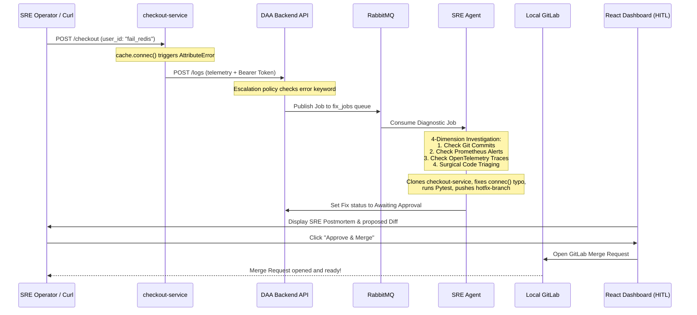

# DAA E2E Demo & Walkthrough Specification

This document details the architecture, security model, and step-by-step execution workflow of the DAA End-to-End Walkthrough Demo.

---

## 🏗️ Architecture Overview

The DAA walkthrough simulates a real-world multi-service production environment completely offline. It consists of the following components:

1. **DAA Main Platform (Core Engine):**
   - **Backend API (`localhost:8000`):** FastAPI app managing auth, logs, incidents, escalation policies, and RabbitMQ job dispatching.
   - **React Dashboard (`localhost:5003`):** UI console for monitoring incidents, viewing SRE agent execution logs, and approving proposed hotfixes (HITL mode).
   - **RabbitMQ:** Event broker dispatching diagnostic jobs.
   - **PostgreSQL:** Primary database storing incidents, applications, and policies.
   - **SRE Agent:** ReAct reasoning agent that reads repository maps, locates bugs, runs verification tests, and generates merge requests.

2. **walkthrough Sandbox Services (`daa-e2e-demo`):**
   - **Local GitLab (`localhost:8082`):** Simulates the enterprise code forge containing microservice repositories.
   - **Redis Cache (`localhost:6379`):** Cache dependency for the checkout service.
   - **Checkout Service (`localhost:8001`):** Python FastAPI service that contains the target `AttributeError` bug.
   - **Payment Service (`localhost:8002`):** Mock downstream dependency of the Checkout Service.
   - **Test App (`localhost:8081`):** Standard web service used to verify multi-error ingestion.

---

## 🔒 Security & Token Authorization Model

To ensure enterprise-grade security while keeping local simulations frictionless, DAA implements a dual JWT-based authentication system:

### 1. User Authentication (Dashboard & CLI)
- Standard SRE users register via `/auth/register` and authenticate via `/auth/login`.
- A temporary JWT is returned containing an expiration claim (`exp` set to 30 minutes).
- **Security Check:** The backend API strictly validates the expiration claim on every user request. Bypasses are prohibited to prevent session hijacking.

### 2. Application Telemetry Authentication (SDK Ingestion)
- Microservices use **Application Tokens** to submit telemetry to `/logs/`.
- Tokens are generated once during registration. Since these do not contain `exp` claims, they are permanent, avoiding the need for credentials renewal in long-running services.
- **Scope Restriction:** The backend validates that an application token can only submit logs for the specific application it was issued to.
- **Allowed IP Validation:** Optional IP whitelist enforcement. The incoming connection host is verified against the registered `allowed_ip` (supporting Docker bridge gateways like `172.22.0.1` and loopbacks).

---

## 🚀 Step-by-Step E2E Walkthrough Flow

The orchestrator script `run_demo.py` automates the entire outage-to-resolution lifecycle:

### Detailed Flow Execution:

1. **Service Startup & GitLab Token Setup:**
   - Docker Compose spins up GitLab CE, Redis, and empty databases.
   - GitLab personal access token is configured: `c8d8f8fa6ec414fdf8de3193b8391f0077e7089d`.
2. **Local SDK Mounting & Build:**
   - To prevent container builds from attempting to fetch the SDK over the network before the Docker network bridge is active, `run_demo.py` copies `app/daa-sdk` locally into the service folders.
   - The services' docker files install the SDK locally from `./daa-sdk`.
3. **Application Registration:**
   - Registers `checkout-service`, `payment-service`, and `test-app` in DAA.
   - Sets up escalation policies immediately triggering on `AttributeError`.
   - Writes credentials to `.env` and recreates microservice containers.
4. **Outage Trigger:**
   - Triggers `fail_redis` checkout request.
   - Checkout service catches `AttributeError` and pushes the telemetry log to the DAA backend.
5. **Deduplication and Escalation:**
   - The backend checks for active incidents matching the fingerprint.
   - It escalates immediately because `AttributeError` is an immediate severity keyword.
6. **Remediation Loop:**
   - SRE Agent consumes the RabbitMQ message.
   - Agent performs AST mapping of the checkout-service code using `read_repomap` and `find_symbol`.
   - Locates `cache.connec()` and replaces it with `cache.connect()`.
   - Runs `pytest` inside the checkout-service codebase to ensure tests pass.
   - Creates a hotfix branch, commits the fix, pushes to GitLab, and registers a proposed fix in the backend.
7. **Human Approval:**
   - SRE Operator visits the React Admin Panel, reviews the Postmortem, and approves the proposed fix.
   - SRE Agent opens the Merge Request in GitLab.
