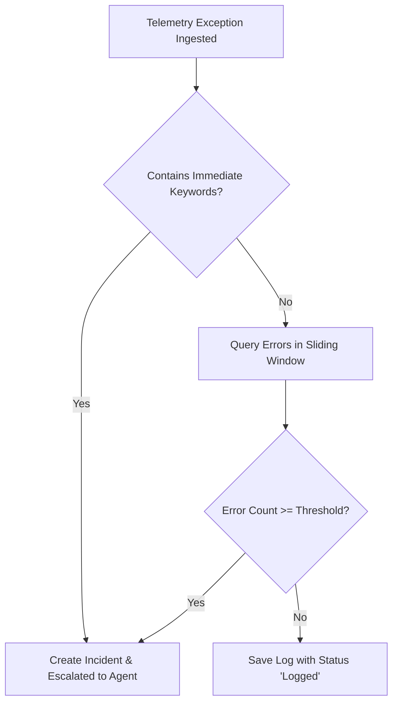

# DAA Global Business Logic Specification

This document details the core business logic, workflows, decision matrices, and safety limits of the DAA platform.

## 1. Ingestion & Escalation Workflow

The following flowchart describes how DAA determines whether to invoke the autonomous agent or suppress log reports:

### A. Sliding Window Metric
- **Default Window**: 120 seconds.
- **Default Threshold**: 15 errors.
- **Immediate Keywords**: `["FATAL", "OOMKill", "PANIC", "DatabaseDeadlock"]`.
- Customizable per application via `EscalationPolicy` configurations.

---

## 2. Fingerprint Deduplication Logic
To prevent agent execution storms (multiple agents trying to fix the same bug simultaneously):
1. **Fingerprint Hash**: Calculated as `SHA-256(app_name + exception_type + log_content[:200])[:16]`.
2. **Database Check**: Queries active incidents with status in `["investigating", "pr_open", "ticket_created", "cooldown"]`. If matched, increments incident counter and suppresses agent.
3. **Stateless Remote Check**: If running without a database, the system queries the remote Git server for a branch named `fix/<fingerprint[:12]>`. If the branch exists, the incident is assumed to be in-flight and the agent execution is skipped.

---

## 3. Orchestration Phases (DAA 3.0)

### Phase 1: Pre-Flight
- Resolves Git repo URL and pulls the latest main/master branch into local cache `/var/daa/repo-cache/<app_name>`.
- Creates an isolated git worktree at `/tmp/daa/<incident_id>`.
- Hydrates log details from 4 dimensions:
  - **Dim 1**: Live exception traceback.
  - **Dim 2**: 500 lines of application logs before the incident.
  - **Dim 3**: Metrics snapshot at the outage timestamp.
  - **Dim 4**: Last 10 commits to trace code modifications.
- Assembles a structured system prompt using `ContextPackager`.

### Phase 2: Agent Core (ReAct Execution)
- Runs LangChain ReAct loop with Gemini, OpenAI, or Claude.
- **Safety Layer 1 (Planning Step)**: The agent is forbidden from running tools until it outputs a JSON plan containing:
  - `"hypothesis"`: Cause assumption.
  - `"evidence_needed"`: Files/metrics to read.
  - `"will_not_check"`: Out-of-scope files.
- **Safety Layer 2 (Hard Cap)**: Tool calls are limited to 8 calls per run. A budget warning is injected at 5 calls. If 8 calls are exceeded, `CapExceededException` is thrown, aborting the agent.
- **Execution Output**: Agent terminates by writing either `WRITE_DIFF` (with a unified patch diff) or `WRITE_ESCALATION` (reason and partial diagnosis).

### Phase 3: Post-Flight
- Parses the final patch or escalation.
- Applies patch diffs to the worktree using the system `patch` command.
- Ststages, commits, and pushes to branch `fix/<fingerprint[:12]>`.
- Idempotently creates a Pull Request via GitHub/GitLab APIs.
- Generates a Markdown postmortem report and updates the Incident record.
- Cleans up worktrees.

---

## 4. Agent Remediation & Circuit Breaker Logic
- **Testing**: Runs the application test suite (`run_tests` tool) to verify the patch.
- **Circuit Breaker**: If `run_tests` fails twice on a fix attempt, OR if the exception matches structural issues (e.g. `NotImplementedError`, complex race conditions), the agent immediately stops writing files and triggers `create_incident_ticket` to create a Jira issue.
- **Test Inconclusive**: If test executables are missing (command not found/exit code 127), the check is skipped and the agent proceeds to open a PR directly.

---

## 5. Secure Multi-Repository Context Access

To allow the SRE Agent to triage bugs that stem from shared libraries, dependencies, or upstream microservices:

1. **Authorization via Registration**: The SRE Agent is strictly prohibited from pulling code from arbitrary URLs injected dynamically in incoming error logs (guarding against Server-Side Request Forgery - SSRF). It can only fetch data from secondary repositories that are explicitly pre-registered in the DAA database.
2. **Work isolation (Primary Target)**: For any given incident log, the SRE Agent will only clone/worktree and execute code modifications on the target application's repository. Only this primary repository gets written to and verified via test execution on-disk.
3. **Read-Only Hybrid Access**: Any auxiliary repositories registered as dependencies are accessed in a read-only manner. Instead of being cloned to the worker disk, their files are queried dynamically via Git REST APIs (GitHub/GitLab/Gitea), keeping the SRE worker workspace isolated and lightweight.
