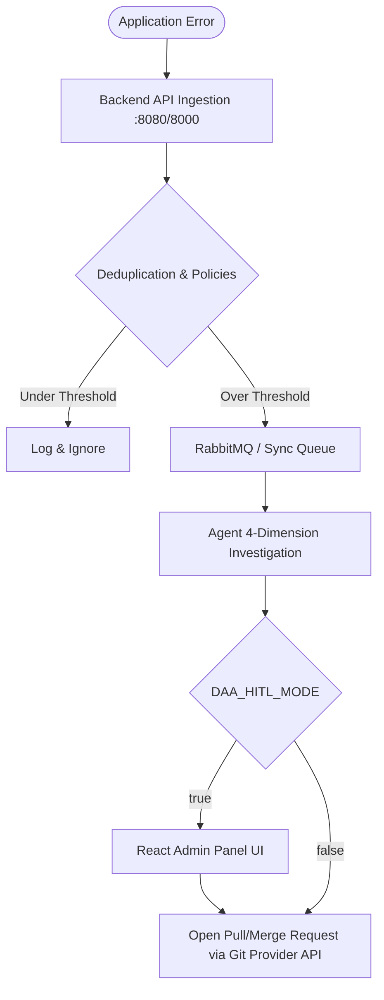

# System Overview & Architecture

DAA employs a three-phase hybrid pipeline for autonomous incident resolution.

## Architectural Flow

## Modes of Operation

1. **Standalone (Serverless Edge)**: Runs purely in a single container. Great for Cloud Run. Internal communication is synchronous.
2. **Distributed Scale-Out (Compose)**: Uses separate containers for the React Admin Panel, Postgres Database, RabbitMQ, and the Agent worker.

## Core Services

- **backend-api**: FastAPI ingestion engine that receives telemetry and enforces cooldowns.
- **python-agent**: Langchain ReAct loop with a hard 8-call budget cap. Uses AST grep tools.
- **admin-panel**: A Human-in-the-Loop review dashboard to approve PRs before they are opened.
