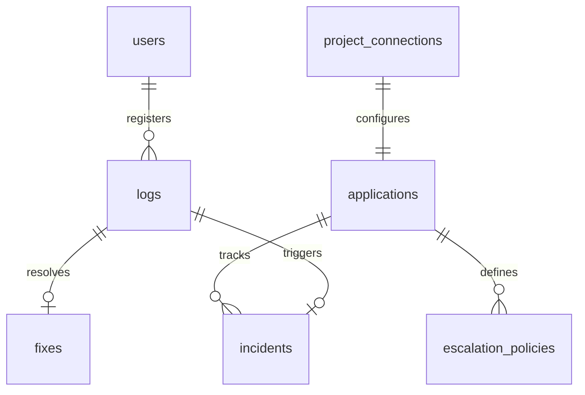

# DAA Global Data Model Specification

This document details the database schema, SQLAlchemy models, properties, relationships, and constraints in the DAA system.

## 1. Entity Relationship Overview

DAA maps microservice exception streams to `Incident` models. A breach of an `EscalationPolicy` for a registered `Application` triggers the agent pipeline, producing a `Fix` linked to the original `Log`.

---

## 2. Table Specifications

### Users (`users`)
Stores platform user profiles and administrative roles.
- `id` (VARCHAR, PK): Unique UUID v4 string.
- `username` (VARCHAR, Unique, Indexed): User identifier.
- `passwordHash` (VARCHAR): Salted password hash.
- `role` (VARCHAR): User authorization role (default: `"User"`, can be `"Administrator"` or `"application"`).

### Logs (`logs`)
Incoming telemetry exceptions submitted by SDKs.
- `id` (VARCHAR, PK): Unique UUID v4.
- `userId` (VARCHAR, FK -> `users.id`): Identity of the submitter (nullable).
- `app_name` (VARCHAR): Submitting microservice name.
- `content` (TEXT): Exception details / raw traceback.
- `status` (VARCHAR): Sliding-window result (e.g. `"Escalated to Agent"`, `"Logged (Threshold not reached)"`, `"Suppressed (Dedup)"`).
- `timestamp` (DATETIME): Time of ingestion (UTC).
- `exception_type` (VARCHAR, Nullable): Python/Node exception class name (e.g. `OOMError`).
- `trace_id` (VARCHAR, Nullable, Indexed): OpenTelemetry distributed trace identifier.
- `correlation_id` (VARCHAR, Nullable): Correlated trace ID.
- `metadata_json` (TEXT, Nullable): Environment variables, runtime context, or pod tags.

### Incidents (`incidents`)
Active anomalies or outages tracked by DAA.
- `id` (VARCHAR, PK): Unique incident identifier.
- `fingerprint` (VARCHAR, Indexed): SHA-256 hash of `app_name + exception_type + top_stack_frame`.
- `app_name` (VARCHAR, Indexed): Affected service.
- `status` (VARCHAR): Investigational status (`"investigating"`, `"pr_open"`, `"ticket_created"`, `"cooldown"`, `"resolved"`, `"human_required"`).
- `occurrence_count` (INTEGER): Deduplicated occurrence frequency counter.
- `first_seen_at` (DATETIME): Incident creation time.
- `last_seen_at` (DATETIME): Last error timestamp matched to this fingerprint.
- `cooldown_until` (DATETIME, Nullable): Lockout expiry time for auto-remediator.
- `agent_attempts` (INTEGER): Attempt count for healing this incident.
- `root_cause_summary` (TEXT, Nullable): Natural language diagnosis summary.
- `confidence_score` (INTEGER, Nullable): Agent confidence percent.
- `pr_url` (VARCHAR, Nullable): Pull request hyperlink.
- `ticket_url` (VARCHAR, Nullable): Jira ticket hyperlink.
- `postmortem_md` (TEXT, Nullable): Complete Markdown postmortem report.

### Fixes (`fixes`)
Code fixes attempted by the agent.
- `id` (VARCHAR, PK): Unique UUID v4.
- `logId` (VARCHAR, FK -> `logs.id`): Source exception log.
- `timestamp` (DATETIME): Generation time.
- `generatedFix` (TEXT): Unified git patch/diff text.
- `postmortem` (TEXT): Full incident postmortem.
- `isApproved` (BOOLEAN): True if approved by SRE in UI.
- `status` (VARCHAR): Execution state (`"Pending"`, `"Applied"`, `"Failed"`).
- `pull_request_url` (VARCHAR): Generated PR hyperlink.

### Applications (`applications`)
Microservice registries.
- `id` (VARCHAR, PK): Unique app identifier.
- `name` (VARCHAR, Unique, Indexed): Logical identifier.
- `description` (VARCHAR, Nullable): Service description.
- `language` (VARCHAR, Nullable): Programming language (e.g. `"go"`, `"python"`).
- `repository_url` (VARCHAR, Nullable): Remote git repository URL.
- `spec_file_path` (VARCHAR, Nullable): Path to spec.
- `team_owner` (VARCHAR, Nullable): Owning team name.
- `allowed_ip` (VARCHAR, Nullable): IP matching for dynamic CORS.
- `token` (TEXT, Nullable): Authentication key for telemetry ingestion.
- `created_at` (DATETIME): Registration timestamp.

### Escalation Policies (`escalation_policies`)
Ingestion filters defining when to wake up the agent.
- `id` (VARCHAR, PK): Policy identifier.
- `application_id` (VARCHAR, FK -> `applications.id`): Target app.
- `rule_type` (VARCHAR): E.g., `"error_rate_threshold"`, `"severity_immediate"`.
- `condition_value` (INTEGER, Nullable): Number of errors to trigger.
- `window_seconds` (INTEGER): Sliding window width.
- `severity_keywords` (TEXT, Nullable): JSON string of immediate trigger words (e.g. `["FATAL"]`).
- `cooldown_minutes` (INTEGER): Prevent agent double-firing.
- `is_active` (BOOLEAN): Status toggle.

### Project Connections (`project_connections`)
Git and ticket tracker authorization keys.
- `id` (VARCHAR, PK): Connection UUID.
- `app_name` (VARCHAR, Unique, Indexed): Microservice key.
- `repo_provider` (VARCHAR): E.g., `"github"`, `"gitlab"`, `"gitea"`.
- `repo_url` (VARCHAR): Repository clone address.
- `repo_token` (VARCHAR): Git access token.
- `jira_url` (VARCHAR): Jira Cloud base URL.
- `jira_token` (VARCHAR): Jira REST API credential.
- `jira_project_key` (VARCHAR): Targeted Jira board prefix (e.g. `"INC"`).

---

## 3. Database Migration Logic

Migrations are run dynamically on startup via the `run_db_migrations()` helper inside [database.py](file:///home/rutvej/Desktop/DAA/app/backend-api/src/database.py#L245-L260). It inspects existing schemas to safely append missing columns such as `allowed_ip` and `token` to the `applications` table without blowing away data.
